# Atlas Dependency Graph

Static import graph for `atlas.*` imports. Edges are approximate and do not include dynamic imports.

```mermaid
graph TD
  atlas_ablation[atlas.ablation] -->|2| atlas_corpus[atlas.corpus]
  atlas_acf[atlas.acf] -->|1| atlas_birth[atlas.birth]
  atlas_acf[atlas.acf] -->|1| atlas_classification[atlas.classification]
  atlas_acf[atlas.acf] -->|1| atlas_essence[atlas.essence]
  atlas_acf[atlas.acf] -->|1| atlas_export[atlas.export]
  atlas_acf[atlas.acf] -->|1| atlas_identity[atlas.identity]
  atlas_acf[atlas.acf] -->|1| atlas_interpretation[atlas.interpretation]
  atlas_acf[atlas.acf] -->|1| atlas_invariant[atlas.invariant]
  atlas_acf[atlas.acf] -->|1| atlas_profiles[atlas.profiles]
  atlas_acf[atlas.acf] -->|1| atlas_signatures[atlas.signatures]
  atlas_classification[atlas.classification] -->|3| atlas_signatures[atlas.signatures]
  atlas_comparison[atlas.comparison] -->|1| atlas_corpus[atlas.corpus]
  atlas_corpus[atlas.corpus] -->|1| atlas_fusion[atlas.fusion]
  atlas_corpus[atlas.corpus] -->|1| atlas_ive[atlas.ive]
  atlas_corpus[atlas.corpus] -->|1| atlas_ontology[atlas.ontology]
  atlas_database[atlas.database] -->|1| atlas_library[atlas.library]
  atlas_essence[atlas.essence] -->|1| atlas_ciphers[atlas.ciphers]
  atlas_essence[atlas.essence] -->|2| atlas_export[atlas.export]
  atlas_essence[atlas.essence] -->|1| atlas_kamea[atlas.kamea]
  atlas_essence[atlas.essence] -->|1| atlas_profiles[atlas.profiles]
  atlas_essence[atlas.essence] -->|1| atlas_signatures[atlas.signatures]
  atlas_essence[atlas.essence] -->|3| atlas_topology[atlas.topology]
  atlas_explanation[atlas.explanation] -->|1| atlas_ontology[atlas.ontology]
  atlas_export[atlas.export] -->|2| atlas_features[atlas.features]
  atlas_export[atlas.export] -->|1| atlas_resonance[atlas.resonance]
  atlas_export[atlas.export] -->|2| atlas_signatures[atlas.signatures]
  atlas_export[atlas.export] -->|4| atlas_topology[atlas.topology]
  atlas_features[atlas.features] -->|1| atlas_corpus[atlas.corpus]
  atlas_features[atlas.features] -->|2| atlas_topology[atlas.topology]
  atlas_fingerprint[atlas.fingerprint] -->|1| atlas_acf[atlas.acf]
  atlas_fingerprint[atlas.fingerprint] -->|5| atlas_graph[atlas.graph]
  atlas_fingerprint[atlas.fingerprint] -->|1| atlas_motifs[atlas.motifs]
  atlas_graph[atlas.graph] -->|1| atlas_topology[atlas.topology]
  atlas_identity[atlas.identity] -->|1| atlas_invariant[atlas.invariant]
  atlas_identity[atlas.identity] -->|1| atlas_research[atlas.research]
  atlas_identity_bridge[atlas.identity_bridge] -->|10| atlas_temporal[atlas.temporal]
  atlas_intelligence[atlas.intelligence] -->|1| atlas_identity_bridge[atlas.identity_bridge]
  atlas_interpretation[atlas.interpretation] -->|1| atlas_explanation[atlas.explanation]
  atlas_interpretation[atlas.interpretation] -->|1| atlas_ontology[atlas.ontology]
  atlas_interpretation[atlas.interpretation] -->|1| atlas_signatures[atlas.signatures]
  atlas_invariant[atlas.invariant] -->|1| atlas_ciphers[atlas.ciphers]
  atlas_invariant[atlas.invariant] -->|2| atlas_kamea[atlas.kamea]
  atlas_invariant[atlas.invariant] -->|5| atlas_measurement[atlas.measurement]
  atlas_ive[atlas.ive] -->|4| atlas_research[atlas.research]
  atlas_library[atlas.library] -->|1| atlas_export[atlas.export]
  atlas_library[atlas.library] -->|1| atlas_interpretation[atlas.interpretation]
  atlas_library[atlas.library] -->|1| atlas_profiles[atlas.profiles]
  atlas_library[atlas.library] -->|1| atlas_reports[atlas.reports]
  atlas_motifs[atlas.motifs] -->|1| atlas_features[atlas.features]
  atlas_motifs[atlas.motifs] -->|1| atlas_topology[atlas.topology]
  atlas_profiles[atlas.profiles] -->|1| atlas_ciphers[atlas.ciphers]
  atlas_profiles[atlas.profiles] -->|2| atlas_export[atlas.export]
  atlas_profiles[atlas.profiles] -->|1| atlas_kamea[atlas.kamea]
  atlas_profiles[atlas.profiles] -->|1| atlas_signatures[atlas.signatures]
  atlas_profiles[atlas.profiles] -->|1| atlas_topology[atlas.topology]
  atlas_reports[atlas.reports] -->|1| atlas_acf[atlas.acf]
  atlas_reports[atlas.reports] -->|1| atlas_interpretation[atlas.interpretation]
  atlas_reports[atlas.reports] -->|1| atlas_ive[atlas.ive]
  atlas_research[atlas.research] -->|1| atlas_identity_bridge[atlas.identity_bridge]
  atlas_research[atlas.research] -->|2| atlas_intelligence[atlas.intelligence]
  atlas_resonance[atlas.resonance] -->|1| atlas_features[atlas.features]
  atlas_resonance[atlas.resonance] -->|2| atlas_signatures[atlas.signatures]
  atlas_resonance[atlas.resonance] -->|5| atlas_topology[atlas.topology]
  atlas_signatures[atlas.signatures] -->|3| atlas_features[atlas.features]
  atlas_signatures[atlas.signatures] -->|2| atlas_motifs[atlas.motifs]
  atlas_signatures[atlas.signatures] -->|3| atlas_topology[atlas.topology]
  atlas_topology[atlas.topology] -->|1| atlas_kamea[atlas.kamea]
  dashboard[dashboard] -->|6| atlas_acf[atlas.acf]
  dashboard[dashboard] -->|7| atlas_calibration[atlas.calibration]
  dashboard[dashboard] -->|6| atlas_classification[atlas.classification]
  dashboard[dashboard] -->|1| atlas_comparison[atlas.comparison]
  dashboard[dashboard] -->|2| atlas_database[atlas.database]
  dashboard[dashboard] -->|1| atlas_diagnostics[atlas.diagnostics]
  dashboard[dashboard] -->|1| atlas_essence[atlas.essence]
  dashboard[dashboard] -->|5| atlas_graph[atlas.graph]
  dashboard[dashboard] -->|1| atlas_interpretation[atlas.interpretation]
  dashboard[dashboard] -->|2| atlas_ive[atlas.ive]
  dashboard[dashboard] -->|1| atlas_kamea[atlas.kamea]
  dashboard[dashboard] -->|15| atlas_library[atlas.library]
  dashboard[dashboard] -->|1| atlas_overlay[atlas.overlay]
  dashboard[dashboard] -->|1| atlas_profiles[atlas.profiles]
  dashboard[dashboard] -->|1| atlas_reports[atlas.reports]
  dashboard[dashboard] -->|17| atlas_research[atlas.research]
  dashboard[dashboard] -->|1| atlas_resonance[atlas.resonance]
  dashboard[dashboard] -->|10| atlas_temporal[atlas.temporal]
  dashboard[dashboard] -->|1| atlas_topology[atlas.topology]
  dashboard[dashboard] -->|2| atlas_visualization[atlas.visualization]
  tests[tests] -->|4| atlas_ablation[atlas.ablation]
  tests[tests] -->|24| atlas_acf[atlas.acf]
  tests[tests] -->|1| atlas_birth[atlas.birth]
  tests[tests] -->|16| atlas_calibration[atlas.calibration]
  tests[tests] -->|3| atlas_ciphers[atlas.ciphers]
  tests[tests] -->|6| atlas_classification[atlas.classification]
  tests[tests] -->|2| atlas_comparison[atlas.comparison]
  tests[tests] -->|6| atlas_corpus[atlas.corpus]
  tests[tests] -->|1| atlas_database[atlas.database]
  tests[tests] -->|1| atlas_datasets[atlas.datasets]
  tests[tests] -->|1| atlas_diagnostics[atlas.diagnostics]
  tests[tests] -->|2| atlas_essence[atlas.essence]
  tests[tests] -->|2| atlas_explanation[atlas.explanation]
  tests[tests] -->|12| atlas_export[atlas.export]
  tests[tests] -->|7| atlas_features[atlas.features]
  tests[tests] -->|2| atlas_fingerprint[atlas.fingerprint]
  tests[tests] -->|1| atlas_fusion[atlas.fusion]
  tests[tests] -->|20| atlas_graph[atlas.graph]
  tests[tests] -->|3| atlas_identity[atlas.identity]
  tests[tests] -->|3| atlas_identity_bridge[atlas.identity_bridge]
  tests[tests] -->|1| atlas_importance[atlas.importance]
  tests[tests] -->|3| atlas_intelligence[atlas.intelligence]
  tests[tests] -->|4| atlas_interpretation[atlas.interpretation]
  tests[tests] -->|5| atlas_invariant[atlas.invariant]
  tests[tests] -->|9| atlas_ive[atlas.ive]
  tests[tests] -->|13| atlas_kamea[atlas.kamea]
  tests[tests] -->|1| atlas_library[atlas.library]
  tests[tests] -->|1| atlas_measurement[atlas.measurement]
  tests[tests] -->|3| atlas_motifs[atlas.motifs]
  tests[tests] -->|1| atlas_ontology[atlas.ontology]
  tests[tests] -->|1| atlas_overlay[atlas.overlay]
  tests[tests] -->|3| atlas_profiles[atlas.profiles]
  tests[tests] -->|1| atlas_provenance[atlas.provenance]
  tests[tests] -->|1| atlas_reports[atlas.reports]
  tests[tests] -->|30| atlas_research[atlas.research]
  tests[tests] -->|6| atlas_resonance[atlas.resonance]
  tests[tests] -->|8| atlas_signatures[atlas.signatures]
  tests[tests] -->|35| atlas_temporal[atlas.temporal]
  tests[tests] -->|30| atlas_topology[atlas.topology]
  tests[tests] -->|1| atlas_visualization[atlas.visualization]
```

## Raw import edges

- `atlas.ablation.__init__` → `atlas.ablation.experiments`
- `atlas.ablation.__init__` → `atlas.ablation.global_harness`
- `atlas.ablation.__init__` → `atlas.ablation.harness`
- `atlas.ablation.__init__` → `atlas.ablation.metrics`
- `atlas.ablation.global_harness` → `atlas.ablation.experiments`
- `atlas.ablation.global_harness` → `atlas.ablation.harness`
- `atlas.ablation.global_harness` → `atlas.corpus.similarity`
- `atlas.ablation.harness` → `atlas.ablation.experiments`
- `atlas.ablation.harness` → `atlas.ablation.metrics`
- `atlas.ablation.harness` → `atlas.corpus.similarity`
- `atlas.ablation.reports` → `atlas.ablation.harness`
- `atlas.acf.__init__` → `atlas.acf.builder`
- `atlas.acf.builder` → `atlas.birth`
- `atlas.acf.builder` → `atlas.classification`
- `atlas.acf.builder` → `atlas.essence.builder`
- `atlas.acf.builder` → `atlas.export.json`
- `atlas.acf.builder` → `atlas.identity`
- `atlas.acf.builder` → `atlas.interpretation.profile`
- `atlas.acf.builder` → `atlas.invariant.pipeline`
- `atlas.acf.builder` → `atlas.profiles.summary`
- `atlas.acf.builder` → `atlas.signatures.fingerprint`
- `atlas.birth.__init__` → `atlas.birth.birth_data`
- `atlas.calibration.nearest_neighbor` → `atlas.calibration.similarity_matrix`
- `atlas.calibration.population_graph` → `atlas.calibration.similarity_matrix`
- `atlas.calibration.population_statistics` → `atlas.calibration.models`
- `atlas.calibration.similarity_engine` → `atlas.calibration.models`
- `atlas.calibration.similarity_engine` → `atlas.calibration.population_statistics`
- `atlas.calibration.similarity_matrix` → `atlas.calibration.models`
- `atlas.calibration.similarity_matrix` → `atlas.calibration.population_statistics`
- `atlas.calibration.similarity_matrix` → `atlas.calibration.similarity_engine`
- `atlas.calibration.structural_clustering` → `atlas.calibration.population_graph`
- `atlas.calibration.zscore_engine` → `atlas.calibration.models`
- `atlas.calibration.zscore_engine` → `atlas.calibration.population_statistics`
- `atlas.classification.__init__` → `atlas.classification.expression`
- `atlas.classification.__init__` → `atlas.classification.functional_role`
- `atlas.classification.__init__` → `atlas.classification.meanings`
- `atlas.classification.__init__` → `atlas.classification.profile_classifier`
- `atlas.classification.__init__` → `atlas.classification.structural_state`
- `atlas.classification.expression` → `atlas.signatures.topology_signature`
- `atlas.classification.profile_classifier` → `atlas.classification.expression`
- `atlas.classification.profile_classifier` → `atlas.classification.functional_role`
- `atlas.classification.profile_classifier` → `atlas.classification.structural_state`
- `atlas.classification.profile_classifier` → `atlas.signatures.topology_signature`
- `atlas.classification.role_calibration` → `atlas.classification.functional_role_v2`
- `atlas.classification.role_diagnostics` → `atlas.classification.functional_role_v2`
- `atlas.classification.structural_state` → `atlas.signatures.topology_signature`
- `atlas.comparison.compare` → `atlas.corpus.similarity`
- `atlas.core.__init__` → `atlas.core.normalization`
- `atlas.corpus.__init__` → `atlas.corpus.builder`
- `atlas.corpus.__init__` → `atlas.corpus.diagnostics`
- `atlas.corpus.__init__` → `atlas.corpus.loader`
- `atlas.corpus.__init__` → `atlas.corpus.search`
- `atlas.corpus.__init__` → `atlas.corpus.similarity`
- `atlas.corpus.__init__` → `atlas.corpus.statistics`
- `atlas.corpus.builder` → `atlas.corpus.export`
- `atlas.corpus.builder` → `atlas.corpus.schema`
- `atlas.corpus.builder` → `atlas.corpus.statistics`
- `atlas.corpus.builder` → `atlas.corpus.validation`
- `atlas.corpus.builder` → `atlas.fusion`
- `atlas.corpus.builder` → `atlas.ive`
- `atlas.corpus.builder` → `atlas.ontology`
- `atlas.corpus.diagnostics` → `atlas.corpus.loader`
- `atlas.corpus.search` → `atlas.corpus.loader`
- `atlas.corpus.search` → `atlas.corpus.similarity`
- `atlas.corpus.validation` → `atlas.corpus.duplicates`
- `atlas.database.__init__` → `atlas.database.index`
- `atlas.database.index` → `atlas.library.profile_library`
- `atlas.datasets.__init__` → `atlas.datasets.manager`
- `atlas.datasets.__init__` → `atlas.datasets.models`
- `atlas.datasets.manager` → `atlas.datasets.models`
- `atlas.diagnostics.__init__` → `atlas.diagnostics.audit`
- `atlas.essence.__init__` → `atlas.essence.builder`
- `atlas.essence.__init__` → `atlas.essence.export_svg`
- `atlas.essence.__init__` → `atlas.essence.profile`
- `atlas.essence.builder` → `atlas.ciphers`
- `atlas.essence.builder` → `atlas.kamea.projection`
- `atlas.essence.builder` → `atlas.topology.graph`
- `atlas.essence.builder` → `atlas.topology.graph_builder`
- `atlas.essence.export_svg` → `atlas.export.svg`
- `atlas.essence.export_svg` → `atlas.topology.graph`
- `atlas.essence.profile` → `atlas.essence.builder`
- `atlas.essence.profile` → `atlas.essence.export_svg`
- `atlas.essence.profile` → `atlas.export.json`
- `atlas.essence.profile` → `atlas.profiles.composite`
- `atlas.essence.profile` → `atlas.signatures.fingerprint`
- `atlas.explanation.__init__` → `atlas.explanation.archetypes`
- `atlas.explanation.__init__` → `atlas.explanation.identity`
- `atlas.explanation.__init__` → `atlas.explanation.measurements`
- `atlas.explanation.__init__` → `atlas.explanation.planets`
- `atlas.explanation.__init__` → `atlas.explanation.relationships`
- `atlas.explanation.__init__` → `atlas.explanation.roles`
- `atlas.explanation.archetypes` → `atlas.ontology.archetypes`
- `atlas.explanation.identity` → `atlas.explanation.measurements`
- `atlas.export.__init__` → `atlas.export.composite_svg`
- `atlas.export.__init__` → `atlas.export.csv`
- `atlas.export.__init__` → `atlas.export.json`
- `atlas.export.__init__` → `atlas.export.svg`
- `atlas.export.csv` → `atlas.features.scoring`
- `atlas.export.csv` → `atlas.signatures.topology_signature`
- `atlas.export.csv` → `atlas.topology.graph`
- `atlas.export.json` → `atlas.features.scoring`
- `atlas.export.json` → `atlas.resonance.resonance`
- `atlas.export.json` → `atlas.signatures.topology_signature`
- `atlas.export.json` → `atlas.topology.differential`
- `atlas.export.json` → `atlas.topology.graph`
- `atlas.export.svg` → `atlas.topology.graph`
- `atlas.features.__init__` → `atlas.features.metrics`
- `atlas.features.__init__` → `atlas.features.scoring`
- `atlas.features.clustering` → `atlas.corpus.similarity`
- `atlas.features.metrics` → `atlas.topology.graph`
- `atlas.features.scoring` → `atlas.features.metrics`
- `atlas.features.scoring` → `atlas.topology.graph`
- `atlas.fingerprint.__init__` → `atlas.fingerprint.builder`
- `atlas.fingerprint.builder` → `atlas.acf.builder`
- `atlas.fingerprint.builder` → `atlas.graph.analysis`
- `atlas.fingerprint.builder` → `atlas.graph.attractor`
- `atlas.fingerprint.builder` → `atlas.graph.coherence`
- `atlas.fingerprint.builder` → `atlas.graph.identity_graph`
- `atlas.fingerprint.builder` → `atlas.graph.reduction`
- `atlas.fingerprint.builder` → `atlas.motifs.identity`
- `atlas.fusion.__init__` → `atlas.fusion.translation`
- `atlas.graph.__init__` → `atlas.graph.analysis`
- `atlas.graph.__init__` → `atlas.graph.coherence`
- `atlas.graph.__init__` → `atlas.graph.identity_graph`
- `atlas.graph.__init__` → `atlas.graph.reduction`
- `atlas.graph.__init__` → `atlas.graph.stack_audit`
- `atlas.graph.attractor` → `atlas.graph.analysis`
- `atlas.graph.attractor` → `atlas.graph.coherence`
- `atlas.graph.canonical` → `atlas.graph.analysis`
- `atlas.graph.canonical` → `atlas.graph.attractor`
- `atlas.graph.canonical` → `atlas.graph.coherence`
- `atlas.graph.canonical` → `atlas.graph.identity_graph`
- `atlas.graph.canonical` → `atlas.graph.reduction`
- `atlas.graph.canonical` → `atlas.topology.topology_signature`
- `atlas.graph.coherence` → `atlas.graph.analysis`
- `atlas.graph.identity_morphology` → `atlas.graph.identity_stack`
- `atlas.graph.identity_resonance` → `atlas.graph.identity_topology`
- `atlas.graph.identity_stack` → `atlas.graph.canonical`
- `atlas.graph.identity_stack` → `atlas.graph.identity_resonance`
- `atlas.graph.identity_stack` → `atlas.graph.identity_topology`
- `atlas.graph.identity_stack` → `atlas.graph.motifs`
- `atlas.graph.identity_stack` → `atlas.graph.structural_genome`
- `atlas.graph.identity_stack` → `atlas.graph.structural_truth`
- `atlas.graph.identity_topology` → `atlas.graph.structural_genome`
- `atlas.graph.reduction` → `atlas.graph.analysis`
- `atlas.graph.structural_genome` → `atlas.graph.motifs`
- `atlas.graph.structural_genome` → `atlas.graph.structural_truth`
- `atlas.graph.structural_truth` → `atlas.graph.canonical`
- `atlas.identity.__init__` → `atlas.identity.builder`
- `atlas.identity.__init__` → `atlas.identity.layer`
- `atlas.identity.__init__` → `atlas.identity.persistence`
- `atlas.identity.__init__` → `atlas.identity.similarity`
- `atlas.identity.builder` → `atlas.identity.layer`
- `atlas.identity.builder` → `atlas.identity.similarity`
- `atlas.identity.builder` → `atlas.invariant.pipeline`
- `atlas.identity.similarity` → `atlas.research.similarity`
- `atlas.identity_bridge` → `atlas.temporal.aspects`
- `atlas.identity_bridge` → `atlas.temporal.birth`
- `atlas.identity_bridge` → `atlas.temporal.dignity`
- `atlas.identity_bridge` → `atlas.temporal.houses`
- `atlas.identity_bridge` → `atlas.temporal.nakshatra`
- `atlas.identity_bridge` → `atlas.temporal.natal_chart`
- `atlas.identity_bridge` → `atlas.temporal.navamsa`
- `atlas.identity_bridge` → `atlas.temporal.transits`
- `atlas.identity_bridge` → `atlas.temporal.vimshottari_dasha`
- `atlas.identity_bridge` → `atlas.temporal.yoga_engine`
- `atlas.importance.__init__` → `atlas.importance.ablation_importance`
- `atlas.intelligence.__init__` → `atlas.intelligence.interpreter`
- `atlas.intelligence.__init__` → `atlas.intelligence.report`
- `atlas.intelligence.interpreter` → `atlas.identity_bridge`
- `atlas.intelligence.report` → `atlas.intelligence.interpreter`
- `atlas.interpretation.__init__` → `atlas.interpretation.identity`
- `atlas.interpretation.__init__` → `atlas.interpretation.profile`
- `atlas.interpretation.__init__` → `atlas.interpretation.rules`
- `atlas.interpretation.identity` → `atlas.explanation`
- `atlas.interpretation.identity` → `atlas.ontology`
- `atlas.interpretation.rules` → `atlas.signatures.topology_signature`
- `atlas.invariant.__init__` → `atlas.invariant.features`
- `atlas.invariant.__init__` → `atlas.invariant.pipeline`
- `atlas.invariant.__init__` → `atlas.invariant.subtype`
- `atlas.invariant.features` → `atlas.invariant.rotations`
- `atlas.invariant.features` → `atlas.measurement.coverage`
- `atlas.invariant.features` → `atlas.measurement.dynamics`
- `atlas.invariant.features` → `atlas.measurement.organization`
- `atlas.invariant.features` → `atlas.measurement.stability`
- `atlas.invariant.features` → `atlas.measurement.structural_roles`
- `atlas.invariant.pipeline` → `atlas.ciphers`
- `atlas.invariant.pipeline` → `atlas.invariant.features`
- `atlas.invariant.pipeline` → `atlas.invariant.subtype`
- `atlas.invariant.pipeline` → `atlas.kamea.path_views`
- `atlas.invariant.pipeline` → `atlas.kamea.projection`
- `atlas.invariant.subtype` → `atlas.invariant.features`
- `atlas.ive.__init__` → `atlas.ive.composite`
- `atlas.ive.__init__` → `atlas.ive.feature_vector`
- `atlas.ive.__init__` → `atlas.ive.identity_vector`
- `atlas.ive.__init__` → `atlas.ive.normalizer`
- `atlas.ive.__init__` → `atlas.ive.relationship_matrix`
- `atlas.ive.__init__` → `atlas.ive.schema`
- `atlas.ive.__init__` → `atlas.ive.similarity`
- `atlas.ive.composite` → `atlas.ive.schema`
- `atlas.ive.feature_vector` → `atlas.ive.schema`
- `atlas.ive.feature_vector` → `atlas.research.attractor_metrics`
- `atlas.ive.feature_vector` → `atlas.research.coherence_metrics`
- `atlas.ive.feature_vector` → `atlas.research.graph_metrics`
- `atlas.ive.feature_vector` → `atlas.research.reduction_metrics`
- `atlas.ive.identity_vector` → `atlas.ive.composite`
- `atlas.ive.identity_vector` → `atlas.ive.feature_vector`
- `atlas.ive.identity_vector` → `atlas.ive.normalizer`
- `atlas.ive.identity_vector` → `atlas.ive.schema`
- `atlas.ive.normalizer` → `atlas.ive.schema`
- `atlas.ive.relationship_matrix` → `atlas.ive.composite`
- `atlas.ive.relationship_matrix` → `atlas.ive.schema`
- `atlas.ive.similarity` → `atlas.ive.composite`
- `atlas.ive.similarity` → `atlas.ive.relationship_matrix`
- `atlas.ive.similarity` → `atlas.ive.schema`
- `atlas.kamea.__init__` → `atlas.kamea.base`
- `atlas.kamea.__init__` → `atlas.kamea.path`
- `atlas.kamea.__init__` → `atlas.kamea.projection`
- `atlas.kamea.__init__` → `atlas.kamea.squares`
- `atlas.kamea.__init__` → `atlas.kamea.validation`
- `atlas.kamea.base` → `atlas.kamea.path`
- `atlas.kamea.base` → `atlas.kamea.planetary_transform`
- `atlas.kamea.base` → `atlas.kamea.validation`
- `atlas.kamea.path_views` → `atlas.kamea.visit_history`
- `atlas.kamea.projection` → `atlas.kamea.path`
- `atlas.kamea.projection` → `atlas.kamea.squares`
- `atlas.kamea.squares` → `atlas.kamea.base`
- `atlas.library.__init__` → `atlas.library.profile_library`
- `atlas.library.profile_library` → `atlas.export.json`
- `atlas.library.profile_library` → `atlas.interpretation.profile`
- `atlas.library.profile_library` → `atlas.profiles.summary`
- `atlas.library.profile_library` → `atlas.reports.markdown`
- `atlas.measurement.__init__` → `atlas.measurement.coverage`
- `atlas.measurement.__init__` → `atlas.measurement.dynamics`
- `atlas.measurement.__init__` → `atlas.measurement.organization`
- `atlas.measurement.__init__` → `atlas.measurement.stability`
- `atlas.measurement.__init__` → `atlas.measurement.structural_roles`
- `atlas.motifs.__init__` → `atlas.motifs.catalog`
- `atlas.motifs.__init__` → `atlas.motifs.detector`
- `atlas.motifs.__init__` → `atlas.motifs.identity`
- `atlas.motifs.__init__` → `atlas.motifs.statistics`
- `atlas.motifs.detector` → `atlas.features.metrics`
- `atlas.motifs.detector` → `atlas.motifs.catalog`
- `atlas.motifs.detector` → `atlas.topology.graph`
- `atlas.motifs.statistics` → `atlas.motifs.catalog`
- `atlas.ontology.__init__` → `atlas.ontology.archetypes`
- `atlas.ontology.__init__` → `atlas.ontology.identity`
- `atlas.ontology.__init__` → `atlas.ontology.structural_roles`
- `atlas.ontology.identity` → `atlas.ontology.archetypes`
- `atlas.ontology.identity` → `atlas.ontology.structural_roles`
- `atlas.overlay.__init__` → `atlas.overlay.composite_overlay`
- `atlas.profiles.__init__` → `atlas.profiles.composite`
- `atlas.profiles.__init__` → `atlas.profiles.summary`
- `atlas.profiles.composite` → `atlas.export.json`
- `atlas.profiles.summary` → `atlas.ciphers`
- `atlas.profiles.summary` → `atlas.export.json`
- `atlas.profiles.summary` → `atlas.kamea.projection`
- `atlas.profiles.summary` → `atlas.signatures.fingerprint`
- `atlas.profiles.summary` → `atlas.topology.graph_builder`
- `atlas.reports.__init__` → `atlas.reports.markdown`
- `atlas.reports.markdown` → `atlas.acf.builder`
- `atlas.reports.markdown` → `atlas.interpretation.profile`
- `atlas.reports.markdown` → `atlas.ive`
- `atlas.research.__init__` → `atlas.research.attractor_metrics`
- `atlas.research.__init__` → `atlas.research.baselines`
- `atlas.research.__init__` → `atlas.research.coherence_metrics`
- `atlas.research.__init__` → `atlas.research.distributions`
- `atlas.research.__init__` → `atlas.research.feature_correlation`
- `atlas.research.__init__` → `atlas.research.feature_importance`
- `atlas.research.__init__` → `atlas.research.feature_variance`
- `atlas.research.__init__` → `atlas.research.graph_metrics`
- `atlas.research.__init__` → `atlas.research.matrix`
- `atlas.research.__init__` → `atlas.research.planetary_vectors`
- `atlas.research.__init__` → `atlas.research.population`
- `atlas.research.__init__` → `atlas.research.schema`
- `atlas.research.__init__` → `atlas.research.vectors`
- `atlas.research.__init__` → `atlas.research.zscores`
- `atlas.research.attractor_metrics` → `atlas.research.graph_metrics`
- `atlas.research.attractor_metrics` → `atlas.research.reduction_metrics`
- `atlas.research.baselines` → `atlas.research.population`
- `atlas.research.coherence_metrics` → `atlas.research.graph_metrics`
- `atlas.research.comparison` → `atlas.research.similarity`
- `atlas.research.distributions` → `atlas.research.population`
- `atlas.research.export_matrix` → `atlas.research.matrix`
- `atlas.research.feature_correlation` → `atlas.research.feature_variance`
- `atlas.research.feature_importance` → `atlas.research.feature_variance`
- `atlas.research.matrix` → `atlas.research.attractor_metrics`
- `atlas.research.matrix` → `atlas.research.coherence_metrics`
- `atlas.research.matrix` → `atlas.research.graph_metrics`
- `atlas.research.matrix` → `atlas.research.reduction_metrics`
- `atlas.research.motion` → `atlas.research.feature_variance`
- `atlas.research.planetary_vectors` → `atlas.research.vectors`
- `atlas.research.population_topology` → `atlas.research.validation`
- `atlas.research.reduction_metrics` → `atlas.research.coherence_metrics`
- `atlas.research.reduction_metrics` → `atlas.research.graph_metrics`
- `atlas.research.session` → `atlas.identity_bridge`
- `atlas.research.session` → `atlas.intelligence.interpreter`
- `atlas.research.session` → `atlas.intelligence.report`
- `atlas.research.statistical` → `atlas.research.validation`
- `atlas.research.zscores` → `atlas.research.baselines`
- `atlas.research.zscores` → `atlas.research.population`
- `atlas.resonance.__init__` → `atlas.resonance.alignment`
- `atlas.resonance.__init__` → `atlas.resonance.clustering`
- `atlas.resonance.__init__` → `atlas.resonance.field`
- `atlas.resonance.__init__` → `atlas.resonance.resonance`
- `atlas.resonance.__init__` → `atlas.resonance.similarity`
- `atlas.resonance.__init__` → `atlas.resonance.vector`
- `atlas.resonance.alignment` → `atlas.features.metrics`
- `atlas.resonance.alignment` → `atlas.signatures.fingerprint`
- `atlas.resonance.alignment` → `atlas.topology.graph`
- `atlas.resonance.clustering` → `atlas.resonance.resonance`
- `atlas.resonance.clustering` → `atlas.topology.graph`
- `atlas.resonance.resonance` → `atlas.resonance.alignment`
- `atlas.resonance.resonance` → `atlas.resonance.similarity`
- `atlas.resonance.resonance` → `atlas.topology.graph`
- `atlas.resonance.similarity` → `atlas.resonance.vector`
- `atlas.resonance.similarity` → `atlas.topology.graph`
- `atlas.resonance.vector` → `atlas.signatures.fingerprint`
- `atlas.resonance.vector` → `atlas.topology.graph`
- `atlas.signatures.__init__` → `atlas.signatures.fingerprint`
- `atlas.signatures.__init__` → `atlas.signatures.graph_entropy`
- `atlas.signatures.__init__` → `atlas.signatures.motif_detection`
- `atlas.signatures.__init__` → `atlas.signatures.topology_signature`
- `atlas.signatures.fingerprint` → `atlas.features.metrics`
- `atlas.signatures.fingerprint` → `atlas.features.scoring`
- `atlas.signatures.fingerprint` → `atlas.motifs.detector`
- `atlas.signatures.fingerprint` → `atlas.motifs.statistics`
- `atlas.signatures.fingerprint` → `atlas.signatures.graph_entropy`
- `atlas.signatures.fingerprint` → `atlas.signatures.motif_detection`
- `atlas.signatures.fingerprint` → `atlas.signatures.topology_signature`
- `atlas.signatures.fingerprint` → `atlas.topology.graph`
- `atlas.signatures.graph_entropy` → `atlas.topology.graph`
- `atlas.signatures.motif_detection` → `atlas.features.metrics`
- `atlas.signatures.motif_detection` → `atlas.topology.graph`
- `atlas.temporal.__init__` → `atlas.temporal.models`
- `atlas.temporal.aspects` → `atlas.temporal.houses`
- `atlas.temporal.birth` → `atlas.temporal.models`
- `atlas.temporal.dignity` → `atlas.temporal.models`
- `atlas.temporal.ephemeris` → `atlas.temporal.models`
- `atlas.temporal.houses` → `atlas.temporal.config`
- `atlas.temporal.houses` → `atlas.temporal.ephemeris`
- `atlas.temporal.houses` → `atlas.temporal.models`
- `atlas.temporal.nakshatra` → `atlas.temporal.models`
- `atlas.temporal.natal_chart` → `atlas.temporal.config`
- `atlas.temporal.natal_chart` → `atlas.temporal.ephemeris`
- `atlas.temporal.natal_chart` → `atlas.temporal.models`
- `atlas.temporal.natal_chart` → `atlas.temporal.sidereal`
- `atlas.temporal.navamsa` → `atlas.temporal.models`
- `atlas.temporal.navamsa` → `atlas.temporal.vargas`
- `atlas.temporal.sidereal` → `atlas.temporal.ephemeris`
- `atlas.temporal.sidereal` → `atlas.temporal.models`
- `atlas.temporal.transits` → `atlas.temporal.birth`
- `atlas.temporal.transits` → `atlas.temporal.ephemeris`
- `atlas.temporal.transits` → `atlas.temporal.models`
- `atlas.temporal.transits` → `atlas.temporal.natal_chart`
- `atlas.temporal.vargas` → `atlas.temporal.models`
- `atlas.temporal.vimshottari_dasha` → `atlas.temporal.nakshatra`
- `atlas.temporal.yoga_engine` → `atlas.temporal.aspects`
- `atlas.temporal.yoga_engine` → `atlas.temporal.dignity`
- `atlas.temporal.yoga_engine` → `atlas.temporal.houses`
- `atlas.temporal.yoga_engine` → `atlas.temporal.models`
- `atlas.temporal.yoga_engine` → `atlas.temporal.yoga_rules`
- `atlas.topology.__init__` → `atlas.topology.graph`
- `atlas.topology.branch_pruning` → `atlas.topology.graph`
- `atlas.topology.differential` → `atlas.topology.graph`
- `atlas.topology.differential` → `atlas.topology.overlay`
- `atlas.topology.graph_builder` → `atlas.kamea.path`
- `atlas.topology.graph_builder` → `atlas.topology.graph`
- `atlas.topology.node_weights` → `atlas.topology.graph`
- `atlas.topology.overlay` → `atlas.topology.graph`
- `atlas.topology.structural_similarity` → `atlas.topology.differential`
- `atlas.topology.structural_similarity` → `atlas.topology.graph`
- `atlas.visualization.__init__` → `atlas.visualization.canonical_graph_plot`
- `atlas.visualization.__init__` → `atlas.visualization.graph_layout`
- `atlas.visualization.__init__` → `atlas.visualization.planetary_composite`
- `atlas.visualization.__init__` → `atlas.visualization.render_options`
- `atlas.visualization.__init__` → `atlas.visualization.topology_3d`
- `atlas.visualization.canonical_graph_plot` → `atlas.visualization.graph_layout`
- `atlas.visualization.planetary_composite` → `atlas.visualization.render_options`
- `dashboard.components.functional_role_panel` → `atlas.classification.functional_role_v2`
- `dashboard.components.functional_role_panel` → `atlas.classification.role_diagnostics`
- `dashboard.components.functional_role_panel` → `atlas.research`
- `dashboard.components.ive_panel` → `atlas.ive`
- `dashboard.components.ive_panel` → `atlas.library.profile_library`
- `dashboard.components.observatory.calibration` → `atlas.research`
- `dashboard.components.observatory.functional_role_v2` → `atlas.classification.functional_role_v2`
- `dashboard.components.observatory.functional_role_v2` → `atlas.classification.role_diagnostics`
- `dashboard.components.observatory.functional_role_v2` → `atlas.research`
- `dashboard.components.observatory.graph_evolution_3d` → `atlas.graph`
- `dashboard.components.observatory.topology_3d` → `atlas.visualization.topology_3d`
- `dashboard.pages.compare_profiles` → `atlas.acf.builder`
- `dashboard.pages.compare_profiles` → `atlas.comparison`
- `dashboard.pages.compare_profiles` → `atlas.ive`
- `dashboard.pages.compare_profiles` → `atlas.library.profile_library`
- `dashboard.pages.identity_stack_lab` → `atlas.graph.identity_stack`
- `dashboard.pages.identity_stack_lab` → `atlas.graph.stack_audit`
- `dashboard.pages.identity_stack_lab` → `atlas.library.profile_library`
- `dashboard.pages.identity_stack_lab` → `atlas.visualization`
- `dashboard.pages.morphology_lab` → `atlas.graph.identity_morphology`
- `dashboard.pages.morphology_lab` → `atlas.graph.identity_stack`
- `dashboard.pages.morphology_lab` → `atlas.library.profile_library`
- `dashboard.pages.population_intelligence` → `atlas.calibration.nearest_neighbor`
- `dashboard.pages.population_intelligence` → `atlas.calibration.population_graph`
- `dashboard.pages.population_intelligence` → `atlas.calibration.similarity_matrix`
- `dashboard.pages.population_intelligence` → `atlas.calibration.structural_clustering`
- `dashboard.pages.population_observatory` → `atlas.calibration.nearest_neighbor`
- `dashboard.pages.population_observatory` → `atlas.calibration.population_graph`
- `dashboard.pages.population_observatory` → `atlas.calibration.similarity_matrix`
- `dashboard.pages.population_topology` → `atlas.library.profile_library`
- `dashboard.pages.population_topology` → `atlas.research.matrix`
- `dashboard.pages.population_topology` → `atlas.research.population_topology`
- `dashboard.pages.population_topology` → `atlas.research.statistical`
- `dashboard.pages.population_topology` → `atlas.research.validation`
- `dashboard.pages.population_validation` → `atlas.library.profile_library`
- `dashboard.pages.population_validation` → `atlas.research.matrix`
- `dashboard.pages.population_validation` → `atlas.research.validation`
- `dashboard.pages.profile_builder` → `atlas.acf.builder`
- `dashboard.pages.profile_builder` → `atlas.database`
- `dashboard.pages.profile_builder` → `atlas.essence.profile`
- `dashboard.pages.profile_builder` → `atlas.interpretation.profile`
- `dashboard.pages.profile_builder` → `atlas.library.profile_library`
- `dashboard.pages.profile_builder` → `atlas.profiles.summary`
- `dashboard.pages.profile_builder` → `atlas.reports.markdown`
- `dashboard.pages.profile_library` → `atlas.acf.builder`
- `dashboard.pages.profile_library` → `atlas.library.profile_library`
- `dashboard.pages.profile_observatory` → `atlas.acf.builder`
- `dashboard.pages.profile_observatory` → `atlas.library.profile_library`
- `dashboard.pages.profile_observatory` → `atlas.overlay`
- `dashboard.pages.profile_observatory` → `atlas.research`
- `dashboard.pages.profile_observatory` → `atlas.resonance`
- `dashboard.pages.profile_test_lab` → `atlas.diagnostics`
- `dashboard.pages.profile_test_lab` → `atlas.library.profile_library`
- `dashboard.pages.profile_test_lab` → `atlas.research`
- `dashboard.pages.research_corpus` → `atlas.database`
- `dashboard.pages.research_corpus` → `atlas.library.profile_library`
- `dashboard.pages.research_session` → `atlas.research.session`
- `dashboard.pages.role_calibration_lab` → `atlas.classification.role_calibration`
- `dashboard.pages.role_calibration_lab` → `atlas.classification.role_diagnostics`
- `dashboard.pages.role_calibration_lab` → `atlas.library.profile_library`
- `dashboard.pages.role_calibration_lab` → `atlas.research`
- `dashboard.pages.statistical_intelligence` → `atlas.library.profile_library`
- `dashboard.pages.statistical_intelligence` → `atlas.research.matrix`
- `dashboard.pages.statistical_intelligence` → `atlas.research.statistical`
- `dashboard.pages.statistical_intelligence` → `atlas.research.validation`
- `dashboard.pages.temporal_intelligence` → `atlas.temporal.aspects`
- `dashboard.pages.temporal_intelligence` → `atlas.temporal.birth`
- `dashboard.pages.temporal_intelligence` → `atlas.temporal.dignity`
- `dashboard.pages.temporal_intelligence` → `atlas.temporal.houses`
- `dashboard.pages.temporal_intelligence` → `atlas.temporal.nakshatra`
- `dashboard.pages.temporal_intelligence` → `atlas.temporal.natal_chart`
- `dashboard.pages.temporal_intelligence` → `atlas.temporal.navamsa`
- `dashboard.pages.temporal_intelligence` → `atlas.temporal.transits`
- `dashboard.pages.temporal_intelligence` → `atlas.temporal.vimshottari_dasha`
- `dashboard.pages.temporal_intelligence` → `atlas.temporal.yoga_engine`
- `dashboard.pages.validation_lab` → `atlas.acf.builder`
- `dashboard.pages.validation_lab` → `atlas.library.profile_library`
- `dashboard.pages.validation_lab` → `atlas.research`
- `dashboard.utils.classification` → `atlas.acf.builder`
- `dashboard.utils.classification` → `atlas.library.profile_library`
- `dashboard.utils.graphs` → `atlas.kamea.projection`
- `dashboard.utils.graphs` → `atlas.topology.graph_builder`
- `tests.run_name_pipeline` → `atlas.ciphers`
- `tests.run_name_pipeline` → `atlas.export.csv`
- `tests.run_name_pipeline` → `atlas.export.json`
- `tests.run_name_pipeline` → `atlas.export.svg`
- `tests.run_name_pipeline` → `atlas.features.scoring`
- `tests.run_name_pipeline` → `atlas.kamea.projection`
- `tests.run_name_pipeline` → `atlas.signatures.fingerprint`
- `tests.run_name_pipeline` → `atlas.topology.graph_builder`
- `tests.test_ablation` → `atlas.ablation.experiments`
- `tests.test_ablation` → `atlas.ablation.harness`
- `tests.test_acf` → `atlas.acf.builder`
- `tests.test_attractor_metrics_expansion` → `atlas.research`
- `tests.test_baselines` → `atlas.research`
- `tests.test_birth_data` → `atlas.acf.builder`
- `tests.test_birth_data` → `atlas.birth`
- `tests.test_branch_pruning` → `atlas.topology.branch_pruning`
- `tests.test_branch_pruning` → `atlas.topology.graph`
- `tests.test_canonical_identity_graph` → `atlas.graph.canonical`
- `tests.test_ciphers` → `atlas.ciphers`
- `tests.test_classification` → `atlas.classification`
- `tests.test_classification` → `atlas.signatures.fingerprint`
- `tests.test_classification` → `atlas.topology.graph`
- `tests.test_classification_meanings` → `atlas.classification.meanings`
- `tests.test_cluster_interpretation` → `atlas.features.cluster_interpretation`
- `tests.test_clustering` → `atlas.features.clustering`
- `tests.test_coherence_metrics_expansion` → `atlas.research`
- `tests.test_comparison` → `atlas.comparison`
- `tests.test_composite_overlay` → `atlas.acf.builder`
- `tests.test_composite_overlay` → `atlas.overlay.composite_overlay`
- `tests.test_composite_svg` → `atlas.export.composite_svg`
- `tests.test_corpus` → `atlas.acf.builder`
- `tests.test_corpus` → `atlas.corpus.builder`
- `tests.test_corpus_diagnostics` → `atlas.corpus.diagnostics`
- `tests.test_corpus_duplicates` → `atlas.corpus.duplicates`
- `tests.test_corpus_search` → `atlas.corpus.search`
- `tests.test_corpus_similarity` → `atlas.corpus.similarity`
- `tests.test_corpus_validation` → `atlas.acf.builder`
- `tests.test_corpus_validation` → `atlas.corpus.validation`
- `tests.test_database_index` → `atlas.database.index`
- `tests.test_dataset_manager` → `atlas.datasets`
- `tests.test_differential` → `atlas.topology.differential`
- `tests.test_differential` → `atlas.topology.graph`
- `tests.test_distributions` → `atlas.research`
- `tests.test_essence` → `atlas.essence.builder`
- `tests.test_essence` → `atlas.essence.profile`
- `tests.test_explanation` → `atlas.acf.builder`
- `tests.test_explanation` → `atlas.explanation`
- `tests.test_explanation` → `atlas.ive`
- `tests.test_explanation_extended` → `atlas.explanation`
- `tests.test_export_csv` → `atlas.export.csv`
- `tests.test_export_csv` → `atlas.features.scoring`
- `tests.test_export_csv` → `atlas.topology.graph`
- `tests.test_export_differential_json` → `atlas.export.json`
- `tests.test_export_differential_json` → `atlas.topology.differential`
- `tests.test_export_differential_json` → `atlas.topology.graph`
- `tests.test_export_json` → `atlas.export.json`
- `tests.test_export_json` → `atlas.features.scoring`
- `tests.test_export_json` → `atlas.topology.graph`
- `tests.test_export_matrix` → `atlas.research.export_matrix`
- `tests.test_export_resonance_json` → `atlas.export.json`
- `tests.test_export_resonance_json` → `atlas.resonance.resonance`
- `tests.test_export_resonance_json` → `atlas.topology.differential`
- `tests.test_export_resonance_json` → `atlas.topology.graph`
- `tests.test_export_signature_csv` → `atlas.export.csv`
- `tests.test_export_signature_csv` → `atlas.signatures.fingerprint`
- `tests.test_export_signature_csv` → `atlas.topology.graph`
- `tests.test_export_signature_json` → `atlas.export.json`
- `tests.test_export_signature_json` → `atlas.signatures.fingerprint`
- `tests.test_export_signature_json` → `atlas.topology.graph`
- `tests.test_export_svg` → `atlas.export.svg`
- `tests.test_export_svg` → `atlas.topology.graph`
- `tests.test_export_svg_3d` → `atlas.export.svg`
- `tests.test_export_svg_3d` → `atlas.topology.graph`
- `tests.test_feature_correlation` → `atlas.research`
- `tests.test_feature_importance` → `atlas.acf.builder`
- `tests.test_feature_importance` → `atlas.research`
- `tests.test_feature_variance` → `atlas.research`
- `tests.test_functional_role_v2` → `atlas.classification.functional_role_v2`
- `tests.test_functional_role_v2` → `atlas.research`
- `tests.test_global_ablation` → `atlas.ablation.experiments`
- `tests.test_global_ablation` → `atlas.ablation.global_harness`
- `tests.test_graph_metrics_expansion` → `atlas.research`
- `tests.test_identity_bridge` → `atlas.identity_bridge`
- `tests.test_identity_fingerprint` → `atlas.fingerprint`
- `tests.test_identity_graph` → `atlas.identity`
- `tests.test_identity_graph_analysis` → `atlas.acf.builder`
- `tests.test_identity_graph_analysis` → `atlas.graph`
- `tests.test_identity_graph_coherence` → `atlas.acf.builder`
- `tests.test_identity_graph_coherence` → `atlas.graph`
- `tests.test_identity_graph_motifs` → `atlas.acf.builder`
- `tests.test_identity_graph_motifs` → `atlas.graph`
- `tests.test_identity_graph_motifs` → `atlas.motifs`
- `tests.test_identity_graph_reduction` → `atlas.acf.builder`
- `tests.test_identity_graph_reduction` → `atlas.graph`
- `tests.test_identity_graph_stack` → `atlas.graph.identity_stack`
- `tests.test_identity_graph_v2` → `atlas.acf.builder`
- `tests.test_identity_graph_v2` → `atlas.graph`
- `tests.test_identity_interpretation` → `atlas.acf.builder`
- `tests.test_identity_interpretation` → `atlas.interpretation`
- `tests.test_identity_interpretation` → `atlas.ive`
- `tests.test_identity_morphology` → `atlas.graph.identity_morphology`
- `tests.test_identity_morphology` → `atlas.graph.identity_stack`
- `tests.test_identity_persistence` → `atlas.identity`
- `tests.test_identity_resonance` → `atlas.graph.identity_resonance`
- `tests.test_identity_resonance` → `atlas.graph.identity_topology`
- `tests.test_identity_topology` → `atlas.graph.identity_topology`
- `tests.test_identity_topology` → `atlas.graph.structural_genome`
- `tests.test_importance` → `atlas.importance`
- `tests.test_intelligence_interpreter` → `atlas.identity_bridge`
- `tests.test_intelligence_interpreter` → `atlas.intelligence.interpreter`
- `tests.test_intelligence_report` → `atlas.identity_bridge`
- `tests.test_intelligence_report` → `atlas.intelligence.interpreter`
- `tests.test_intelligence_report` → `atlas.intelligence.report`
- `tests.test_interpretation` → `atlas.interpretation.profile`
- `tests.test_interpretation` → `atlas.interpretation.rules`
- `tests.test_interpretation` → `atlas.profiles.summary`
- `tests.test_interpretation` → `atlas.signatures.fingerprint`
- `tests.test_interpretation` → `atlas.topology.graph`
- `tests.test_invariant_features` → `atlas.invariant.features`
- `tests.test_invariant_pipeline` → `atlas.invariant.pipeline`
- `tests.test_invariant_rotations` → `atlas.invariant.rotations`
- `tests.test_invariant_subtype` → `atlas.invariant.features`
- `tests.test_invariant_subtype` → `atlas.invariant.subtype`
- `tests.test_ive_composite` → `atlas.acf.builder`
- `tests.test_ive_composite` → `atlas.ive`
- `tests.test_ive_feature_vector` → `atlas.acf.builder`
- `tests.test_ive_feature_vector` → `atlas.ive`
- `tests.test_ive_identity_vector` → `atlas.acf.builder`
- `tests.test_ive_identity_vector` → `atlas.ive`
- `tests.test_ive_normalizer` → `atlas.acf.builder`
- `tests.test_ive_normalizer` → `atlas.ive`
- `tests.test_ive_relationship_matrix` → `atlas.acf.builder`
- `tests.test_ive_relationship_matrix` → `atlas.ive`
- `tests.test_ive_similarity` → `atlas.acf.builder`
- `tests.test_ive_similarity` → `atlas.ive`
- `tests.test_kamea_engine` → `atlas.kamea.projection`
- `tests.test_kamea_engine` → `atlas.kamea.squares`
- `tests.test_kamea_path` → `atlas.kamea.path`
- `tests.test_kamea_path_views` → `atlas.kamea.path_views`
- `tests.test_kamea_path_views` → `atlas.kamea.projection`
- `tests.test_kamea_validation` → `atlas.kamea.squares`
- `tests.test_kamea_visit_history` → `atlas.kamea.projection`
- `tests.test_kamea_visit_history` → `atlas.kamea.visit_history`
- `tests.test_metrics` → `atlas.features.metrics`
- `tests.test_metrics` → `atlas.topology.graph`
- `tests.test_motifs` → `atlas.motifs.detector`
- `tests.test_motifs` → `atlas.motifs.statistics`
- `tests.test_motifs` → `atlas.topology.graph`
- `tests.test_nearest_neighbor` → `atlas.calibration.models`
- `tests.test_nearest_neighbor` → `atlas.calibration.nearest_neighbor`
- `tests.test_nearest_neighbor` → `atlas.calibration.similarity_matrix`
- `tests.test_node_weights` → `atlas.kamea.path`
- `tests.test_node_weights` → `atlas.topology.graph_builder`
- `tests.test_node_weights` → `atlas.topology.node_weights`
- `tests.test_ontology` → `atlas.acf.builder`
- `tests.test_ontology` → `atlas.ive`
- `tests.test_ontology` → `atlas.ontology`
- `tests.test_overlay` → `atlas.topology.graph`
- `tests.test_overlay` → `atlas.topology.overlay`
- `tests.test_planet_matrix` → `atlas.comparison.planet_matrix`
- `tests.test_planetary_composite_svg` → `atlas.identity`
- `tests.test_planetary_composite_svg` → `atlas.visualization`
- `tests.test_planetary_transform` → `atlas.ciphers`
- `tests.test_planetary_transform` → `atlas.kamea.planetary_transform`
- `tests.test_planetary_transform` → `atlas.kamea.projection`
- `tests.test_planetary_vectors` → `atlas.research`
- `tests.test_population` → `atlas.research`
- `tests.test_population_graph` → `atlas.calibration.models`
- `tests.test_population_graph` → `atlas.calibration.population_graph`
- `tests.test_population_graph` → `atlas.calibration.similarity_matrix`
- `tests.test_population_statistics` → `atlas.calibration.models`
- `tests.test_population_statistics` → `atlas.calibration.population_statistics`
- `tests.test_population_topology` → `atlas.research.population_topology`
- `tests.test_population_topology` → `atlas.research.validation`
- `tests.test_population_validation` → `atlas.research.validation`
- `tests.test_profile_library` → `atlas.library.profile_library`
- `tests.test_profile_summary` → `atlas.profiles.summary`
- `tests.test_provenance` → `atlas.provenance`
- `tests.test_reduction_metrics_expansion` → `atlas.research`
- `tests.test_reports` → `atlas.interpretation.profile`
- `tests.test_reports` → `atlas.profiles.summary`
- `tests.test_reports` → `atlas.reports.markdown`
- `tests.test_research_comparison` → `atlas.acf.builder`
- `tests.test_research_comparison` → `atlas.research.comparison`
- `tests.test_research_comparison` → `atlas.research.differential`
- `tests.test_research_diagnostics` → `atlas.diagnostics`
- `tests.test_research_diagnostics` → `atlas.research`
- `tests.test_research_matrix` → `atlas.acf.builder`
- `tests.test_research_matrix` → `atlas.research.matrix`
- `tests.test_research_motion` → `atlas.acf.builder`
- `tests.test_research_motion` → `atlas.research.motion`
- `tests.test_research_schema` → `atlas.research`
- `tests.test_research_session` → `atlas.research.session`
- `tests.test_research_similarity` → `atlas.research.similarity`
- `tests.test_resonance` → `atlas.resonance.alignment`
- `tests.test_resonance` → `atlas.resonance.clustering`
- `tests.test_resonance` → `atlas.resonance.resonance`
- `tests.test_resonance` → `atlas.resonance.similarity`
- `tests.test_resonance` → `atlas.resonance.vector`
- `tests.test_resonance` → `atlas.topology.graph`
- `tests.test_role_calibration` → `atlas.classification.functional_role_v2`
- `tests.test_role_calibration` → `atlas.classification.role_calibration`
- `tests.test_role_calibration` → `atlas.research`
- `tests.test_role_diagnostics` → `atlas.classification.role_diagnostics`
- `tests.test_role_diagnostics` → `atlas.research`
- `tests.test_scoring` → `atlas.features.scoring`
- `tests.test_scoring` → `atlas.topology.graph`
- `tests.test_signatures` → `atlas.signatures.fingerprint`
- `tests.test_signatures` → `atlas.signatures.graph_entropy`
- `tests.test_signatures` → `atlas.signatures.motif_detection`
- `tests.test_signatures` → `atlas.topology.graph`
- `tests.test_similarity_engine` → `atlas.calibration.models`
- `tests.test_similarity_engine` → `atlas.calibration.similarity_engine`
- `tests.test_similarity_matrix` → `atlas.calibration.models`
- `tests.test_similarity_matrix` → `atlas.calibration.similarity_matrix`
- `tests.test_stack_audit` → `atlas.graph.stack_audit`
- `tests.test_statistical_intelligence` → `atlas.research.statistical`
- `tests.test_statistical_intelligence` → `atlas.research.validation`
- `tests.test_structural_attractor` → `atlas.fingerprint`
- `tests.test_structural_attractor` → `atlas.graph.attractor`
- `tests.test_structural_clustering` → `atlas.calibration.population_graph`
- `tests.test_structural_clustering` → `atlas.calibration.structural_clustering`
- `tests.test_structural_genome` → `atlas.graph.structural_genome`
- `tests.test_structural_genome` → `atlas.graph.structural_truth`
- `tests.test_structural_motifs` → `atlas.graph.motifs`
- `tests.test_structural_roles` → `atlas.measurement.structural_roles`
- `tests.test_structural_similarity` → `atlas.topology.graph`
- `tests.test_structural_similarity` → `atlas.topology.structural_similarity`
- `tests.test_structural_truth_graph` → `atlas.graph.canonical`
- `tests.test_structural_truth_graph` → `atlas.graph.structural_truth`
- `tests.test_temporal_aspects` → `atlas.temporal.aspects`
- `tests.test_temporal_aspects` → `atlas.temporal.houses`
- `tests.test_temporal_aspects` → `atlas.temporal.models`
- `tests.test_temporal_aspects` → `atlas.temporal.natal_chart`
- `tests.test_temporal_birth` → `atlas.temporal.birth`
- `tests.test_temporal_ephemeris` → `atlas.temporal.ephemeris`
- `tests.test_temporal_ephemeris` → `atlas.temporal.models`
- `tests.test_temporal_houses` → `atlas.temporal.houses`
- `tests.test_temporal_houses` → `atlas.temporal.models`
- `tests.test_temporal_houses` → `atlas.temporal.natal_chart`
- `tests.test_temporal_nakshatra` → `atlas.temporal.models`
- `tests.test_temporal_nakshatra` → `atlas.temporal.nakshatra`
- `tests.test_temporal_nakshatra` → `atlas.temporal.natal_chart`
- `tests.test_temporal_natal_chart` → `atlas.temporal.config`
- `tests.test_temporal_natal_chart` → `atlas.temporal.models`
- `tests.test_temporal_natal_chart` → `atlas.temporal.natal_chart`
- `tests.test_temporal_navamsa` → `atlas.temporal.models`
- `tests.test_temporal_navamsa` → `atlas.temporal.natal_chart`
- `tests.test_temporal_navamsa` → `atlas.temporal.navamsa`
- `tests.test_temporal_sidereal` → `atlas.temporal.ephemeris`
- `tests.test_temporal_sidereal` → `atlas.temporal.models`
- `tests.test_temporal_sidereal` → `atlas.temporal.sidereal`
- `tests.test_temporal_transits` → `atlas.temporal.models`
- `tests.test_temporal_transits` → `atlas.temporal.natal_chart`
- `tests.test_temporal_transits` → `atlas.temporal.transits`
- `tests.test_temporal_vimshottari_dasha` → `atlas.temporal.models`
- `tests.test_temporal_vimshottari_dasha` → `atlas.temporal.nakshatra`
- `tests.test_temporal_vimshottari_dasha` → `atlas.temporal.natal_chart`
- `tests.test_temporal_vimshottari_dasha` → `atlas.temporal.vimshottari_dasha`
- `tests.test_temporal_yoga_engine` → `atlas.temporal.aspects`
- `tests.test_temporal_yoga_engine` → `atlas.temporal.dignity`
- `tests.test_temporal_yoga_engine` → `atlas.temporal.houses`
- `tests.test_temporal_yoga_engine` → `atlas.temporal.models`
- `tests.test_temporal_yoga_engine` → `atlas.temporal.natal_chart`
- `tests.test_temporal_yoga_engine` → `atlas.temporal.yoga_engine`
- `tests.test_topology_graph_builder` → `atlas.kamea.path`
- `tests.test_topology_graph_builder` → `atlas.topology.graph_builder`
- `tests.test_topology_signature` → `atlas.topology.topology_signature`
- `tests.test_translation_fusion` → `atlas.acf.builder`
- `tests.test_translation_fusion` → `atlas.fusion`
- `tests.test_vectors` → `atlas.research`
- `tests.test_zscore_engine` → `atlas.calibration.models`
- `tests.test_zscore_engine` → `atlas.calibration.zscore_engine`
- `tests.test_zscores` → `atlas.research`