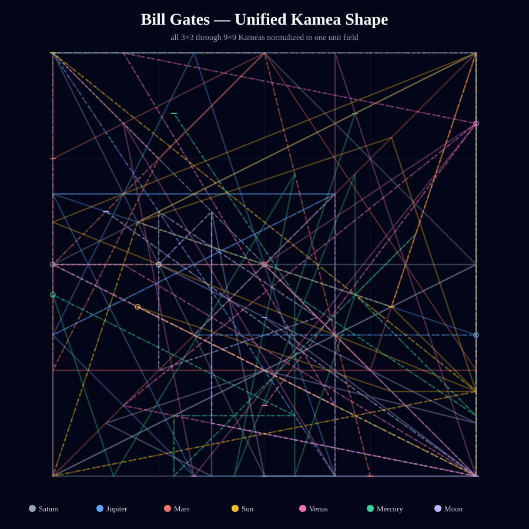
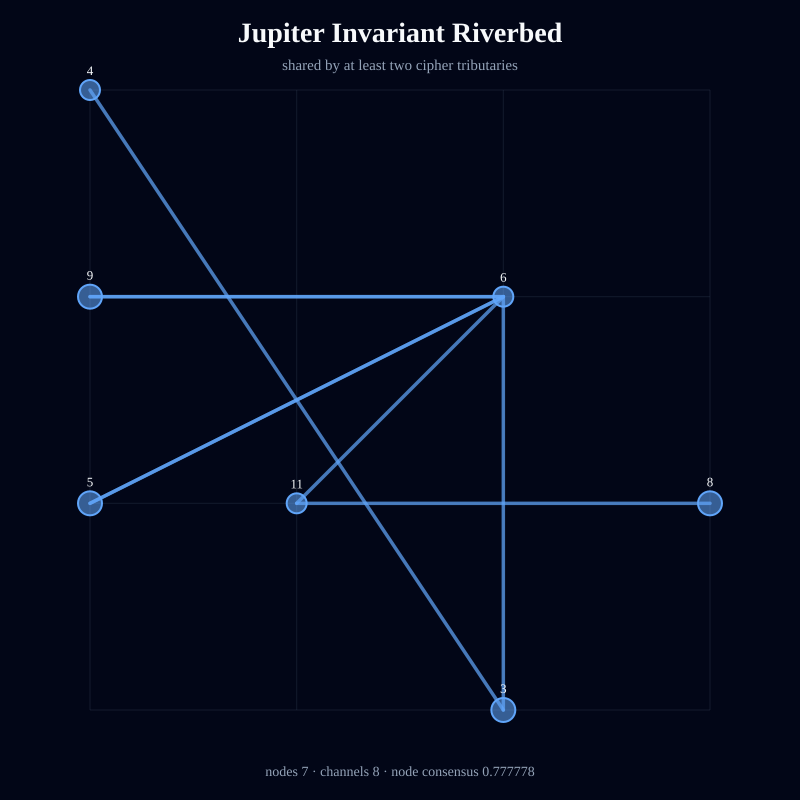
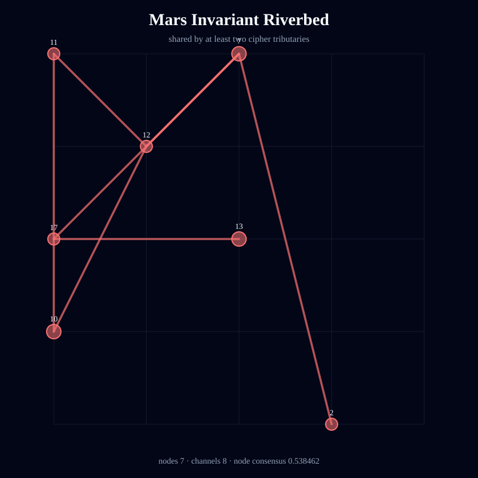
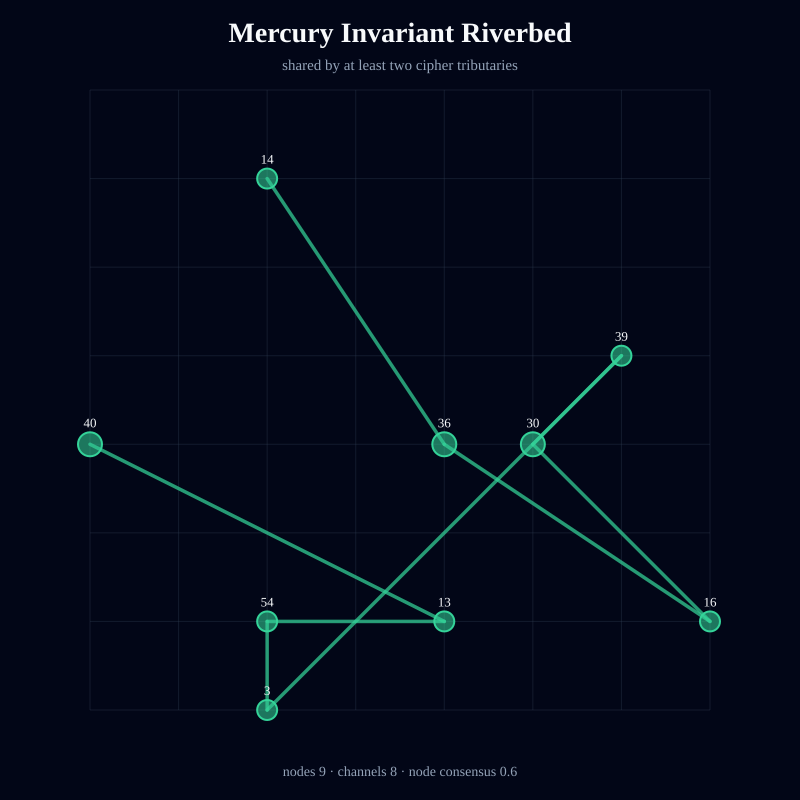
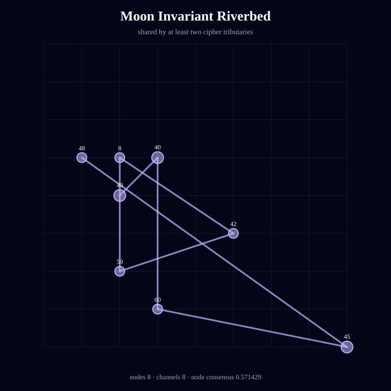
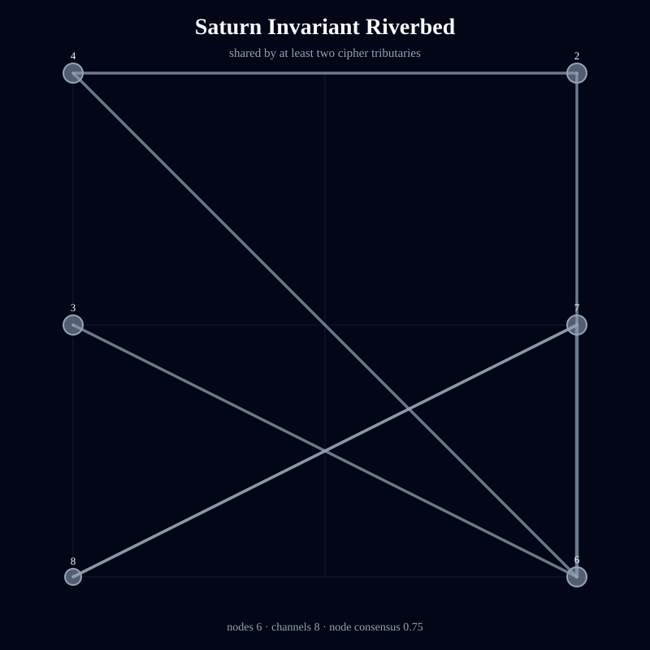
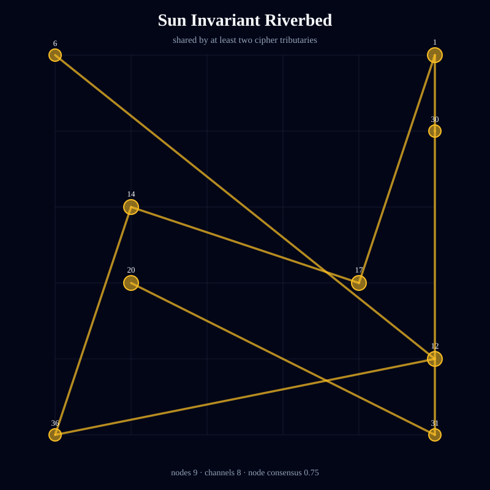
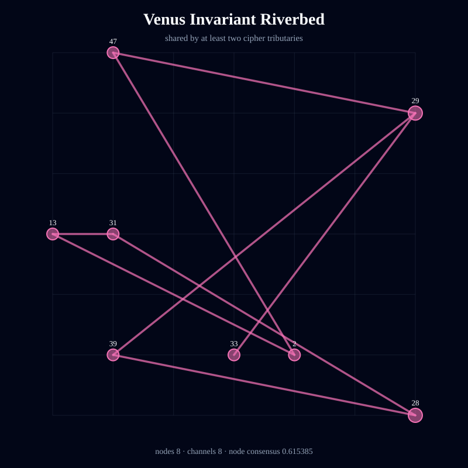

# Kamea Consciousness Flow — Bill Gates

> Deterministic symbolic structure; not an empirical measurement of consciousness or causality.

- Full traversal steps: **189**
- Independent tributaries: **21**
- Directed channels: **166**
- Flow entropy: **0.966407**
- Recurrence: **0.555556**
- Directional coherence: **0.032627**
- Invariant riverbed nodes: **54**
- Invariant riverbed channels: **56**
- Mean geometric shape consensus: **0.529705**

## Unified Geometric Shape

## Planetary Riverbeds

### Jupiter

Streams: 3 · invariant nodes: 7 · invariant channels: 8 · node consensus: 0.777778 · edge consensus: 0.533333

### Mars

Streams: 3 · invariant nodes: 7 · invariant channels: 8 · node consensus: 0.538462 · edge consensus: 0.5

### Mercury

Streams: 3 · invariant nodes: 9 · invariant channels: 8 · node consensus: 0.6 · edge consensus: 0.5

### Moon

Streams: 3 · invariant nodes: 8 · invariant channels: 8 · node consensus: 0.571429 · edge consensus: 0.5

### Saturn

Streams: 3 · invariant nodes: 6 · invariant channels: 8 · node consensus: 0.75 · edge consensus: 0.533333

### Sun

Streams: 3 · invariant nodes: 9 · invariant channels: 8 · node consensus: 0.75 · edge consensus: 0.5

### Venus

Streams: 3 · invariant nodes: 8 · invariant channels: 8 · node consensus: 0.615385 · edge consensus: 0.533333

