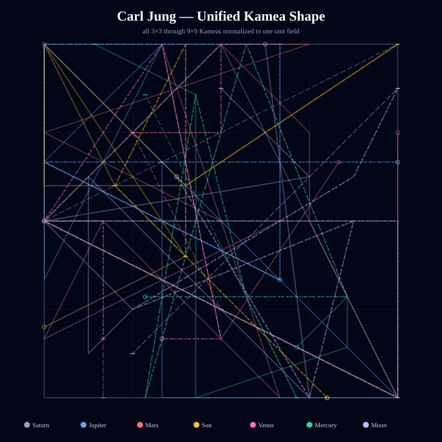
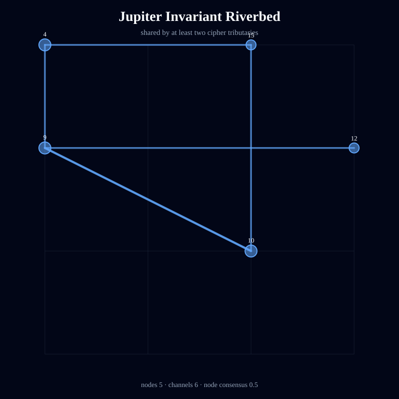
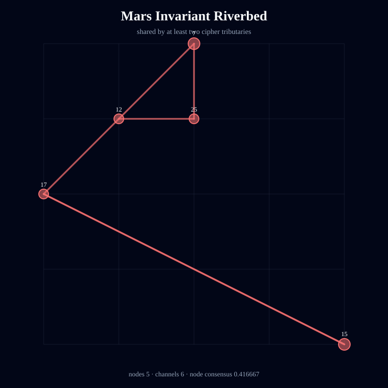
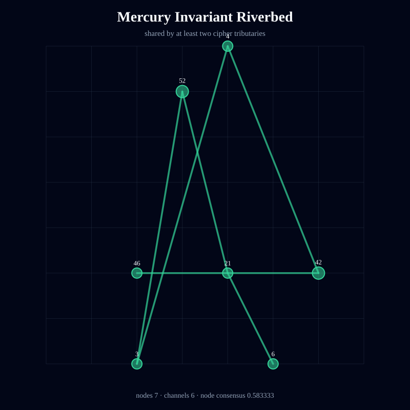
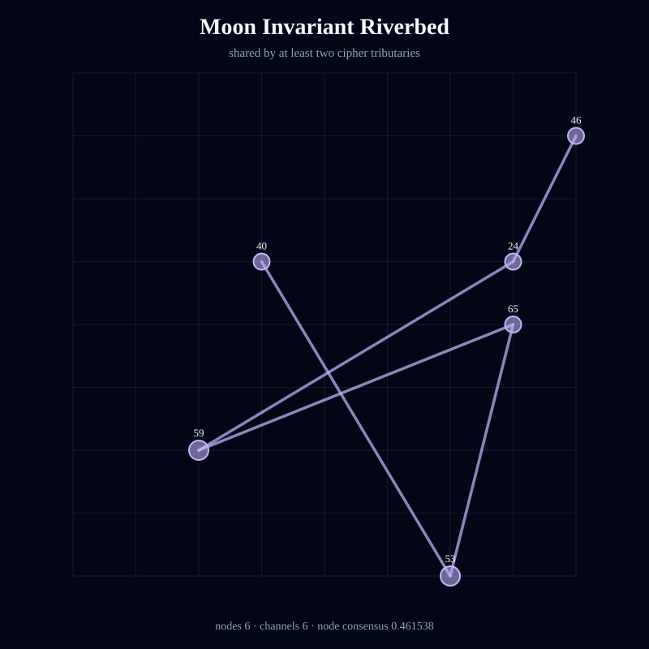
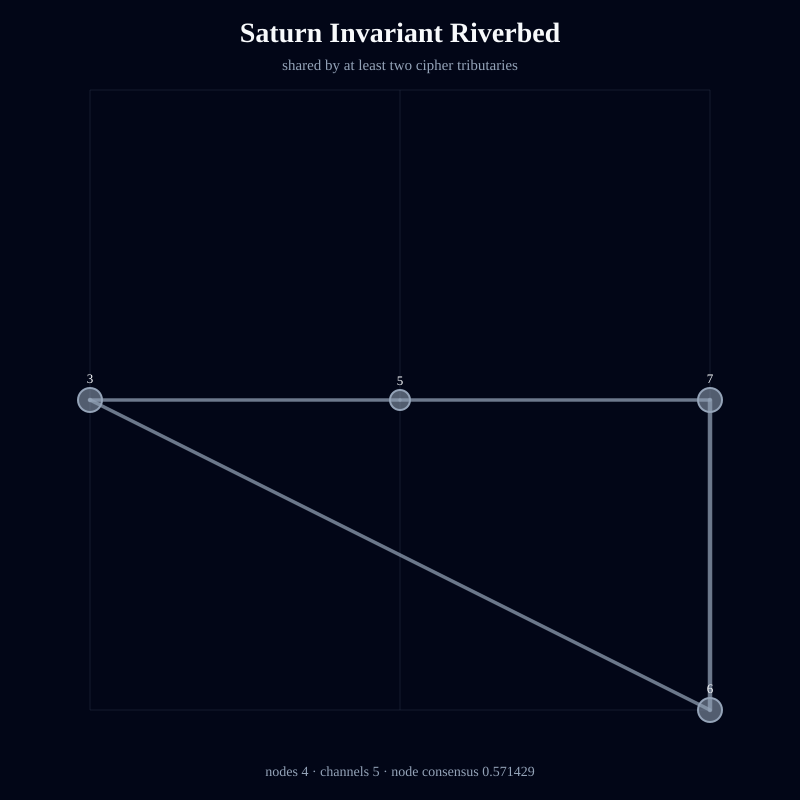
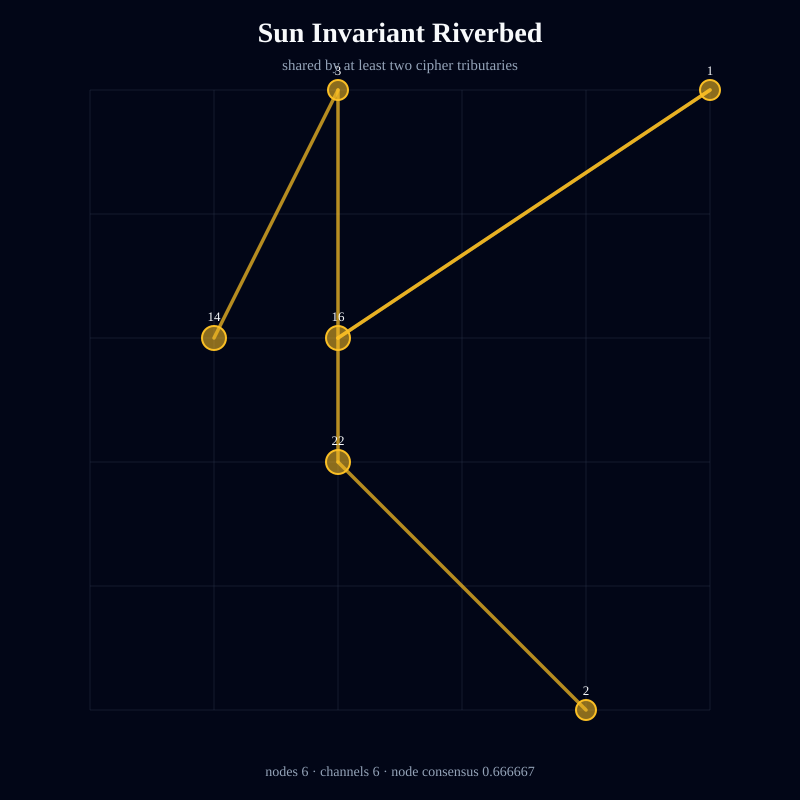
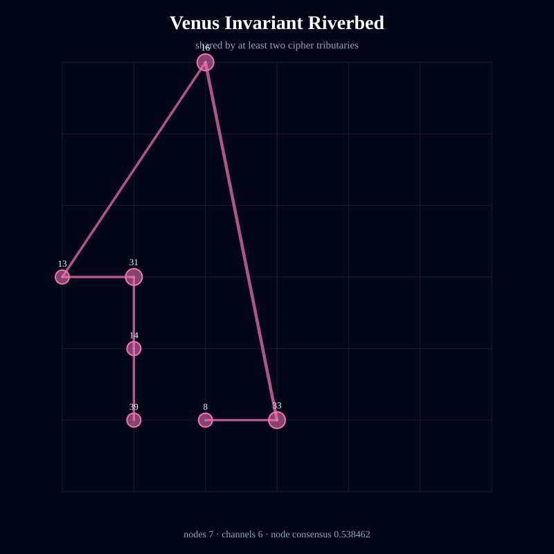

# Kamea Consciousness Flow — Carl Jung

> Deterministic symbolic structure; not an empirical measurement of consciousness or causality.

- Full traversal steps: **161**
- Independent tributaries: **21**
- Directed channels: **137**
- Flow entropy: **0.953575**
- Recurrence: **0.52795**
- Directional coherence: **0.068452**
- Invariant riverbed nodes: **40**
- Invariant riverbed channels: **41**
- Mean geometric shape consensus: **0.469969**

## Unified Geometric Shape

## Planetary Riverbeds

### Jupiter

Streams: 3 · invariant nodes: 5 · invariant channels: 6 · node consensus: 0.5 · edge consensus: 0.461538

### Mars

Streams: 3 · invariant nodes: 5 · invariant channels: 6 · node consensus: 0.416667 · edge consensus: 0.428571

### Mercury

Streams: 3 · invariant nodes: 7 · invariant channels: 6 · node consensus: 0.583333 · edge consensus: 0.461538

### Moon

Streams: 3 · invariant nodes: 6 · invariant channels: 6 · node consensus: 0.461538 · edge consensus: 0.428571

### Saturn

Streams: 3 · invariant nodes: 4 · invariant channels: 5 · node consensus: 0.571429 · edge consensus: 0.454545

### Sun

Streams: 3 · invariant nodes: 6 · invariant channels: 6 · node consensus: 0.666667 · edge consensus: 0.428571

### Venus

Streams: 3 · invariant nodes: 7 · invariant channels: 6 · node consensus: 0.538462 · edge consensus: 0.461538

