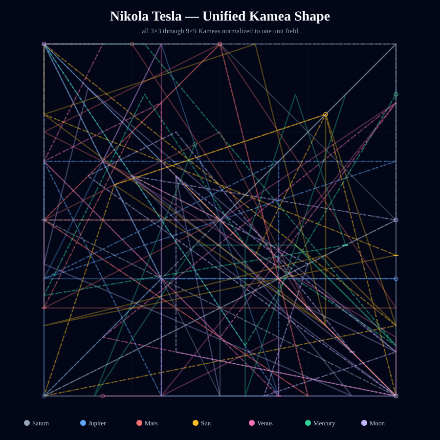
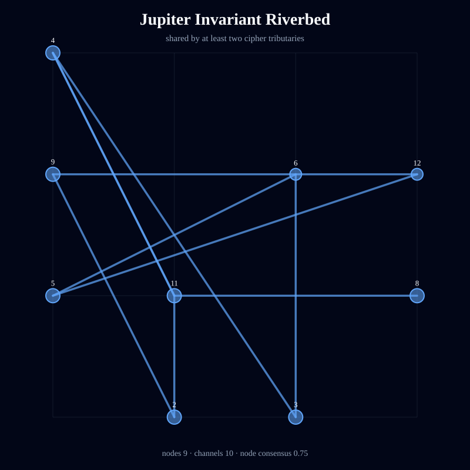
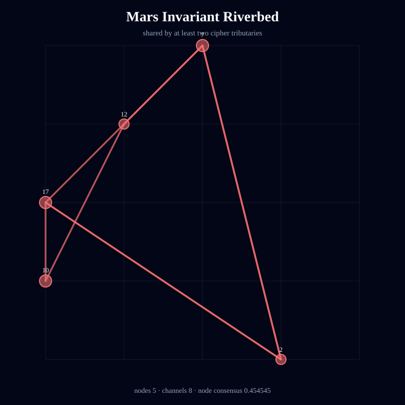
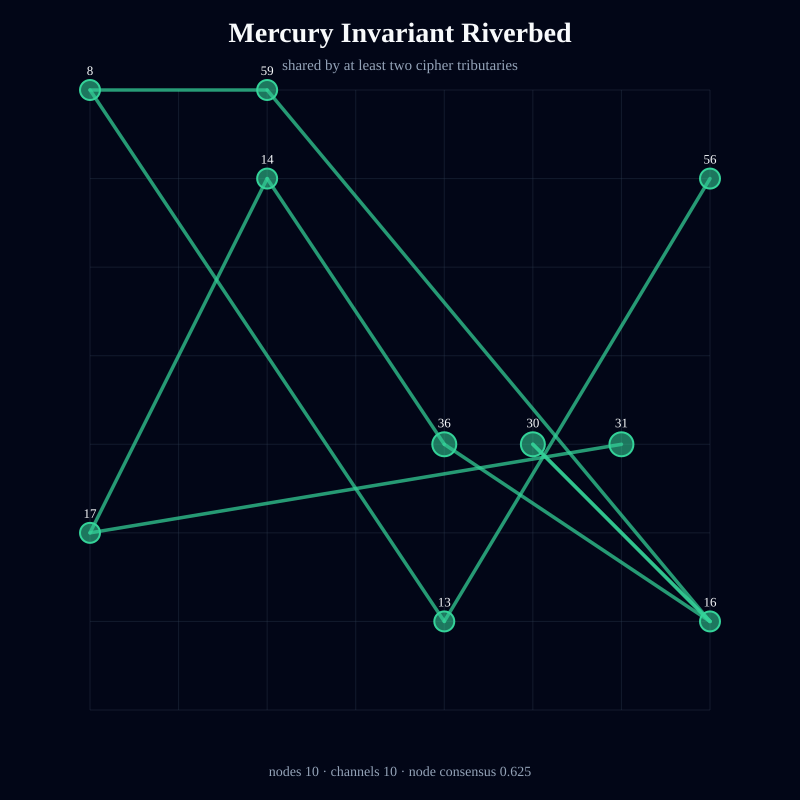
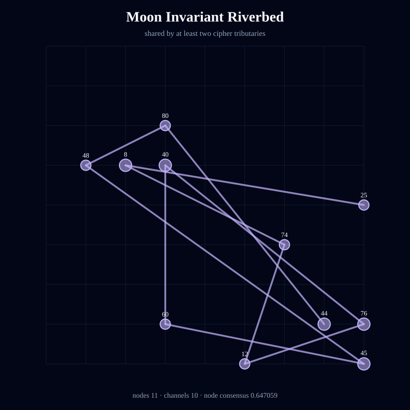
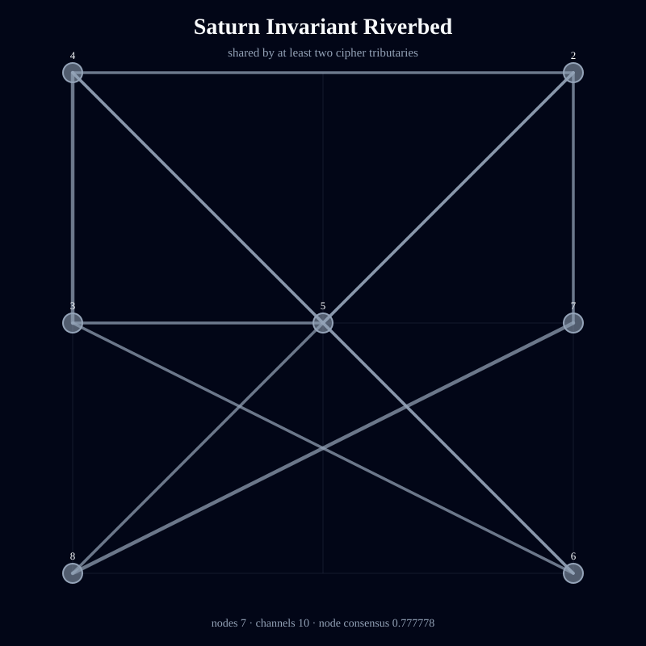
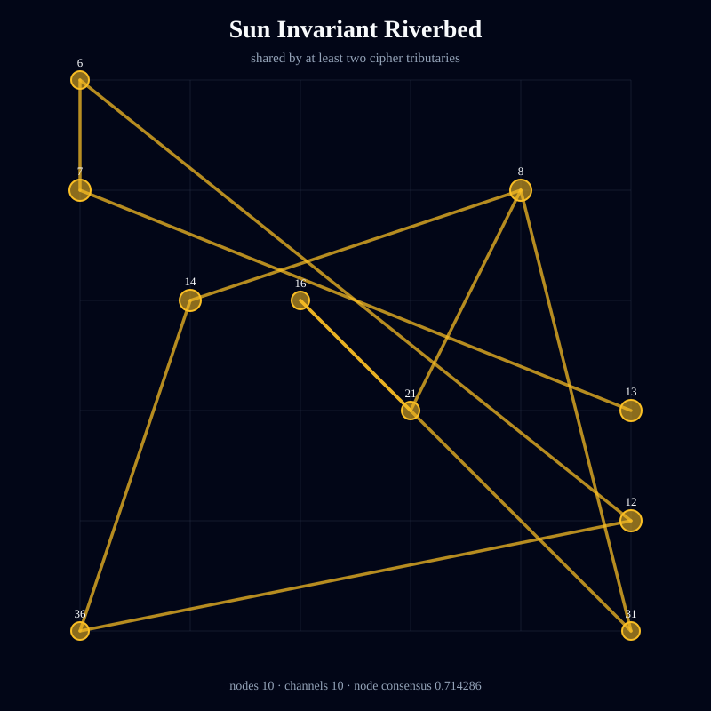
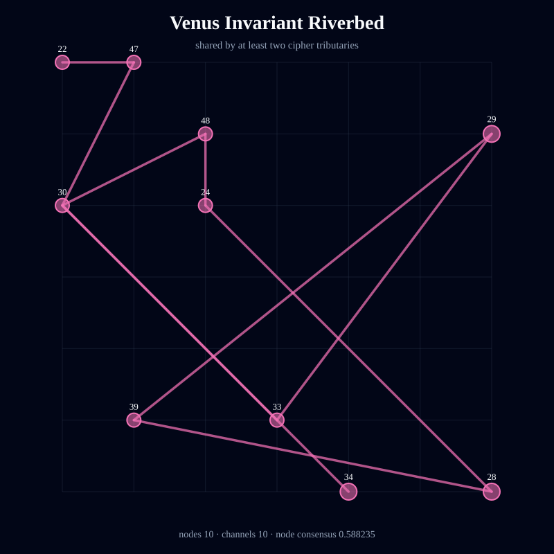

# Kamea Consciousness Flow — Nikola Tesla

> Deterministic symbolic structure; not an empirical measurement of consciousness or causality.

- Full traversal steps: **231**
- Independent tributaries: **21**
- Directed channels: **205**
- Flow entropy: **0.965907**
- Recurrence: **0.584416**
- Directional coherence: **0.074562**
- Invariant riverbed nodes: **62**
- Invariant riverbed channels: **68**
- Mean geometric shape consensus: **0.593052**

## Unified Geometric Shape

## Planetary Riverbeds

### Jupiter

Streams: 3 · invariant nodes: 9 · invariant channels: 10 · node consensus: 0.75 · edge consensus: 0.5

### Mars

Streams: 3 · invariant nodes: 5 · invariant channels: 8 · node consensus: 0.454545 · edge consensus: 0.470588

### Mercury

Streams: 3 · invariant nodes: 10 · invariant channels: 10 · node consensus: 0.625 · edge consensus: 0.5

### Moon

Streams: 3 · invariant nodes: 11 · invariant channels: 10 · node consensus: 0.647059 · edge consensus: 0.5

### Saturn

Streams: 3 · invariant nodes: 7 · invariant channels: 10 · node consensus: 0.777778 · edge consensus: 0.555556

### Sun

Streams: 3 · invariant nodes: 10 · invariant channels: 10 · node consensus: 0.714286 · edge consensus: 0.5

### Venus

Streams: 3 · invariant nodes: 10 · invariant channels: 10 · node consensus: 0.588235 · edge consensus: 0.5

