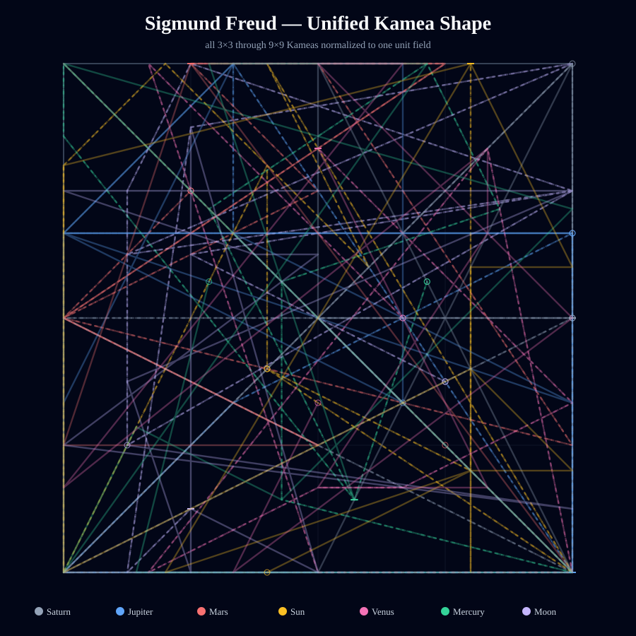
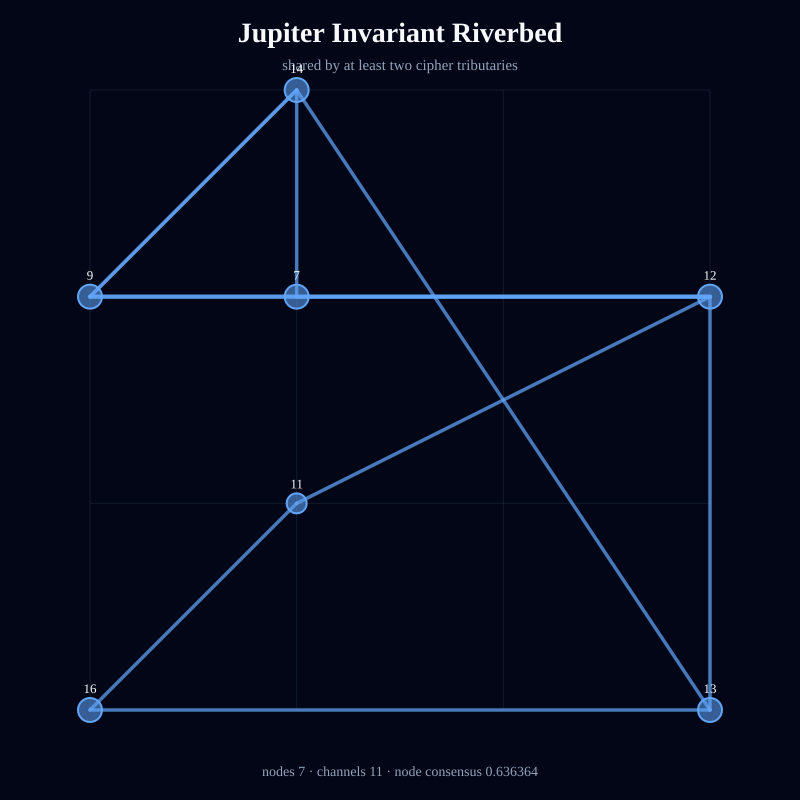
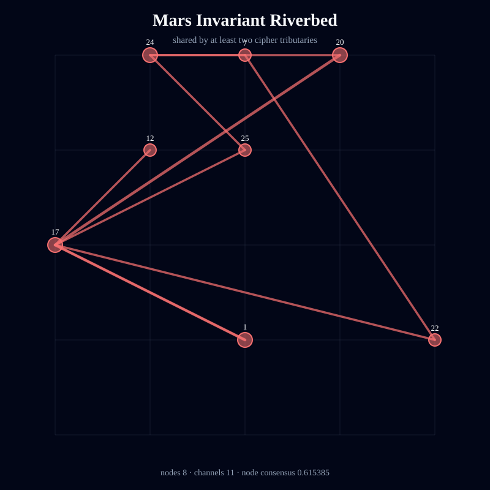
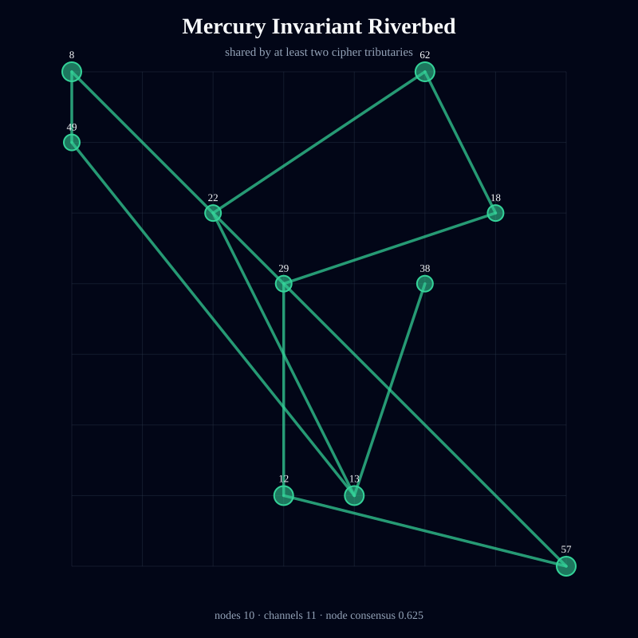
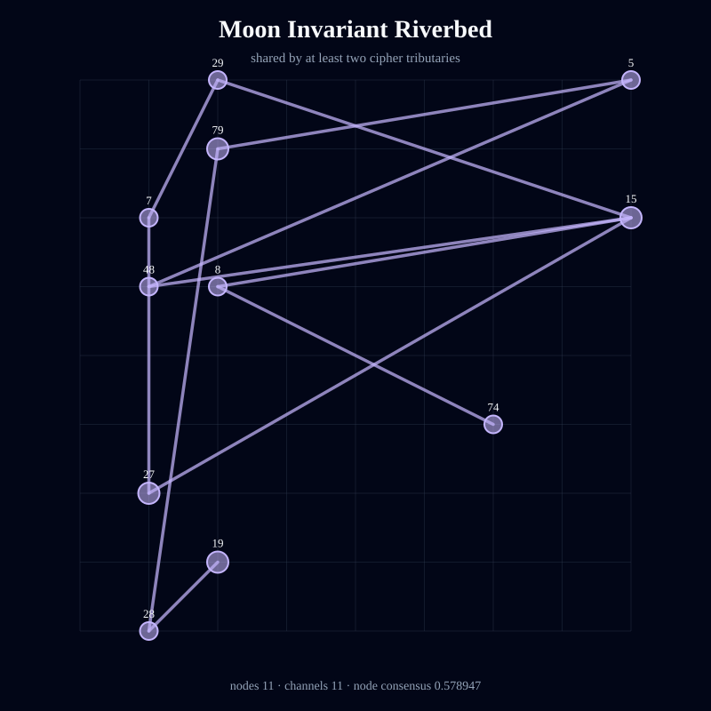
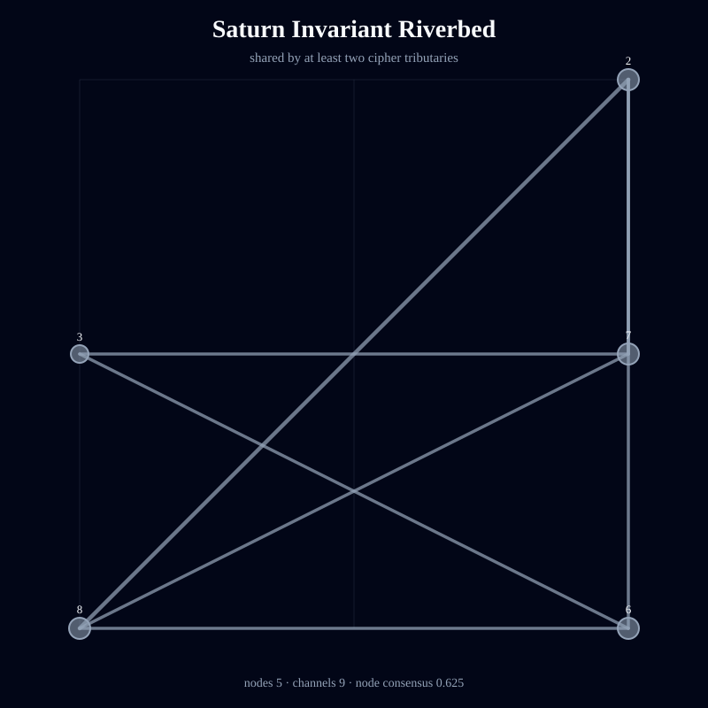
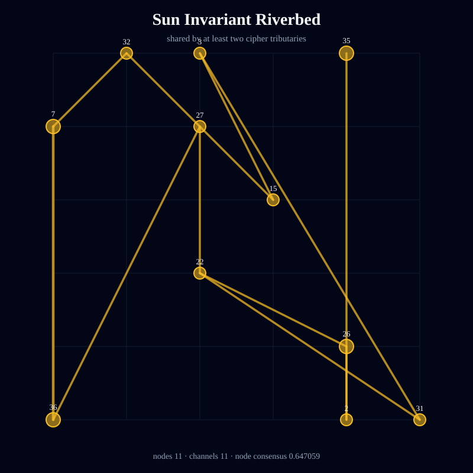
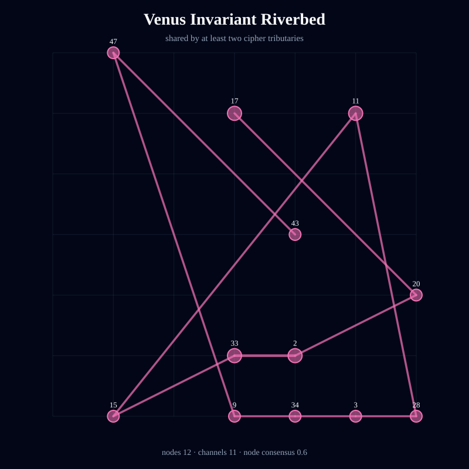

# Kamea Consciousness Flow — Sigmund Freud

> Deterministic symbolic structure; not an empirical measurement of consciousness or causality.

- Full traversal steps: **252**
- Independent tributaries: **21**
- Directed channels: **226**
- Flow entropy: **0.952737**
- Recurrence: **0.587302**
- Directional coherence: **0.017782**
- Invariant riverbed nodes: **64**
- Invariant riverbed channels: **75**
- Mean geometric shape consensus: **0.58144**

## Unified Geometric Shape

## Planetary Riverbeds

### Jupiter

Streams: 3 · invariant nodes: 7 · invariant channels: 11 · node consensus: 0.636364 · edge consensus: 0.52381

### Mars

Streams: 3 · invariant nodes: 8 · invariant channels: 11 · node consensus: 0.615385 · edge consensus: 0.55

### Mercury

Streams: 3 · invariant nodes: 10 · invariant channels: 11 · node consensus: 0.625 · edge consensus: 0.5

### Moon

Streams: 3 · invariant nodes: 11 · invariant channels: 11 · node consensus: 0.578947 · edge consensus: 0.5

### Saturn

Streams: 3 · invariant nodes: 5 · invariant channels: 9 · node consensus: 0.625 · edge consensus: 0.529412

### Sun

Streams: 3 · invariant nodes: 11 · invariant channels: 11 · node consensus: 0.647059 · edge consensus: 0.52381

### Venus

Streams: 3 · invariant nodes: 12 · invariant channels: 11 · node consensus: 0.6 · edge consensus: 0.52381

