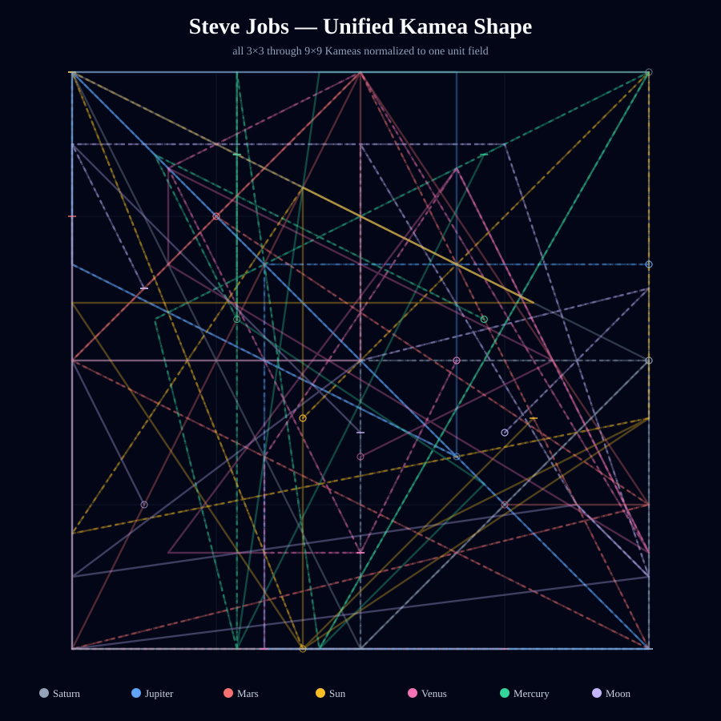
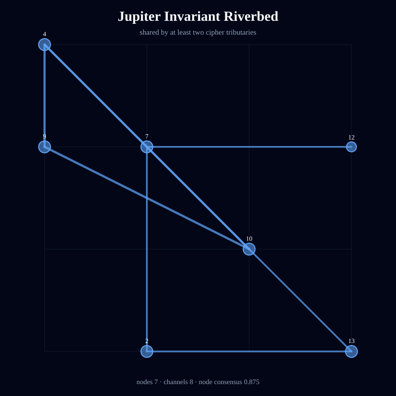
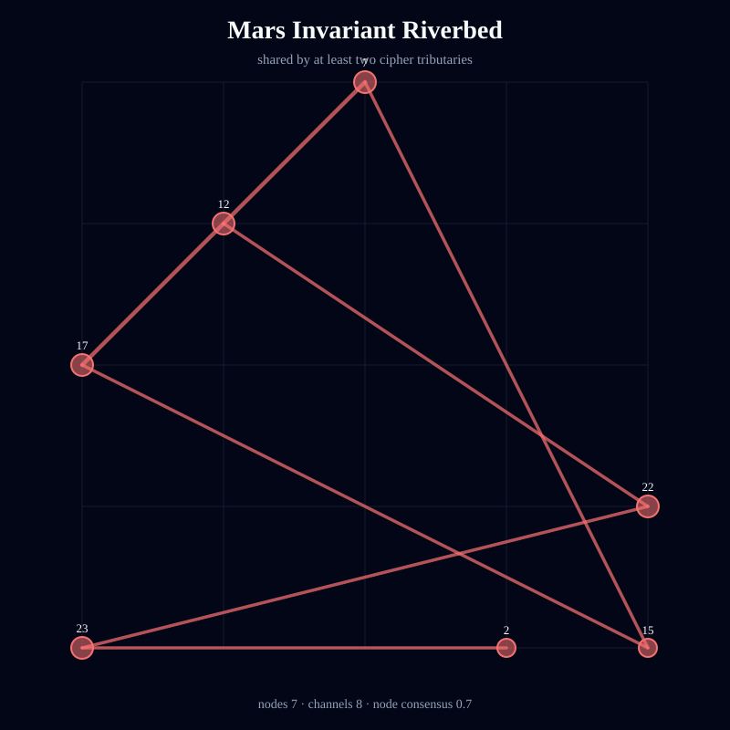
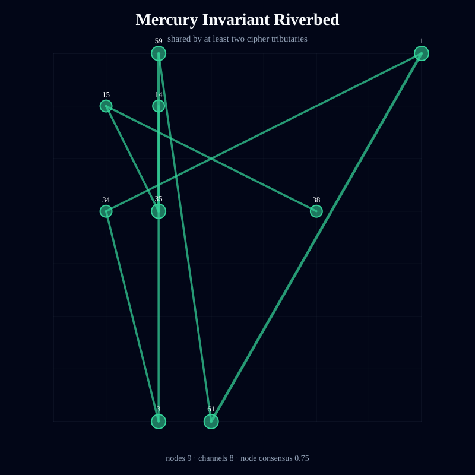
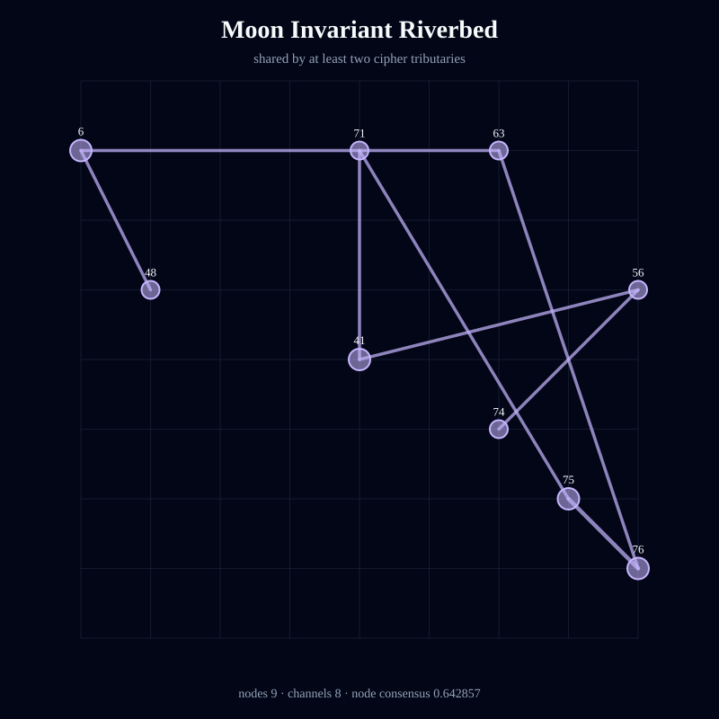
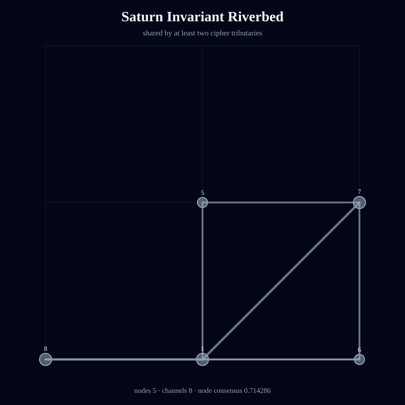
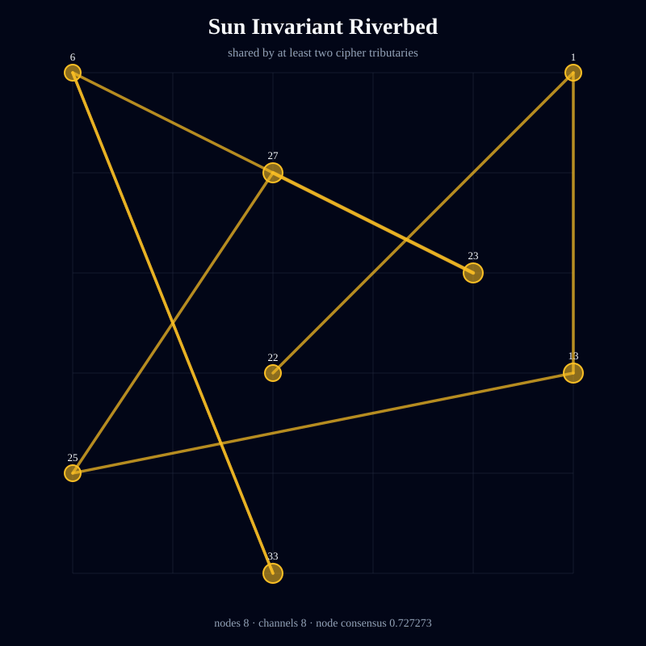
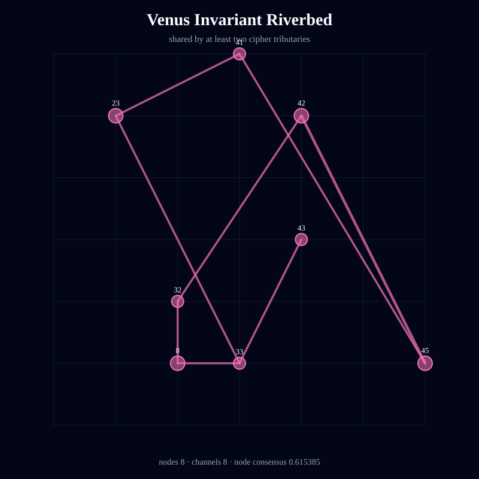

# Kamea Consciousness Flow — Steve Jobs

> Deterministic symbolic structure; not an empirical measurement of consciousness or causality.

- Full traversal steps: **189**
- Independent tributaries: **21**
- Directed channels: **168**
- Flow entropy: **0.964022**
- Recurrence: **0.603175**
- Directional coherence: **0.049669**
- Invariant riverbed nodes: **53**
- Invariant riverbed channels: **56**
- Mean geometric shape consensus: **0.585915**

## Unified Geometric Shape

## Planetary Riverbeds

### Jupiter

Streams: 3 · invariant nodes: 7 · invariant channels: 8 · node consensus: 0.875 · edge consensus: 0.666667

### Mars

Streams: 3 · invariant nodes: 7 · invariant channels: 8 · node consensus: 0.7 · edge consensus: 0.571429

### Mercury

Streams: 3 · invariant nodes: 9 · invariant channels: 8 · node consensus: 0.75 · edge consensus: 0.571429

### Moon

Streams: 3 · invariant nodes: 9 · invariant channels: 8 · node consensus: 0.642857 · edge consensus: 0.533333

### Saturn

Streams: 3 · invariant nodes: 5 · invariant channels: 8 · node consensus: 0.714286 · edge consensus: 0.615385

### Sun

Streams: 3 · invariant nodes: 8 · invariant channels: 8 · node consensus: 0.727273 · edge consensus: 0.533333

### Venus

Streams: 3 · invariant nodes: 8 · invariant channels: 8 · node consensus: 0.615385 · edge consensus: 0.533333

