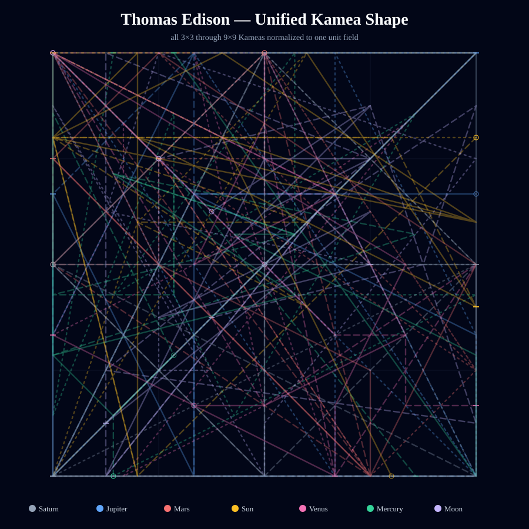
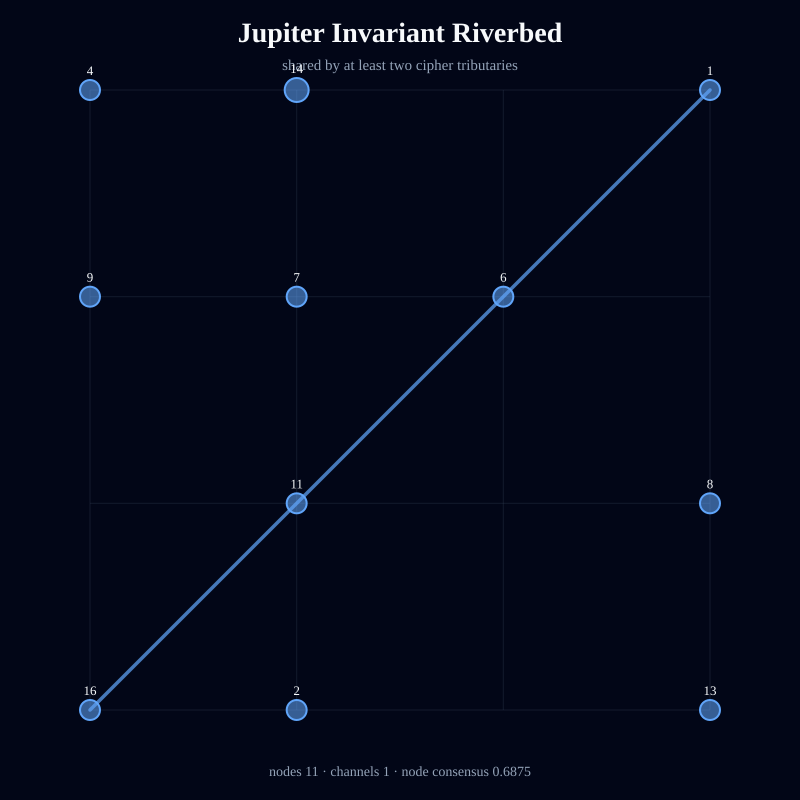
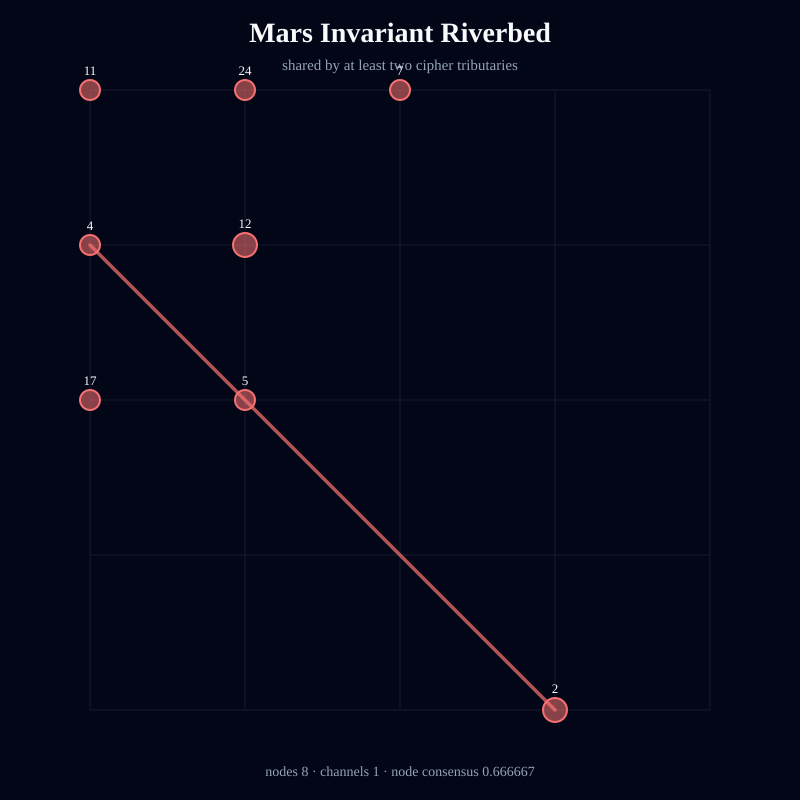
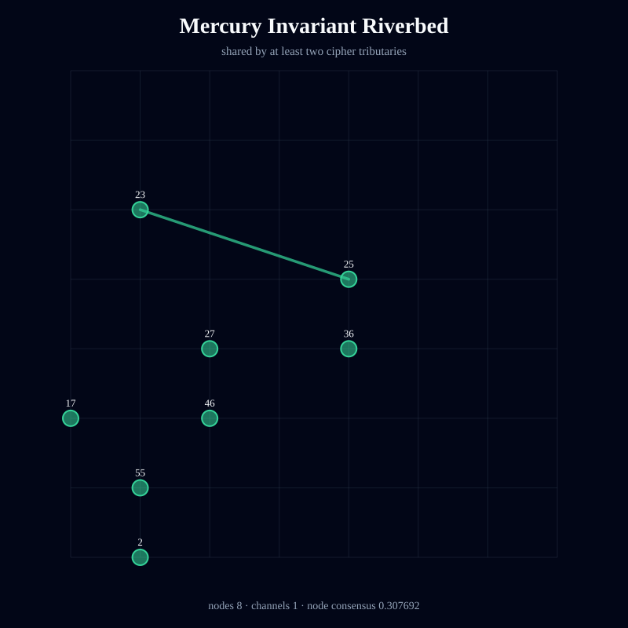
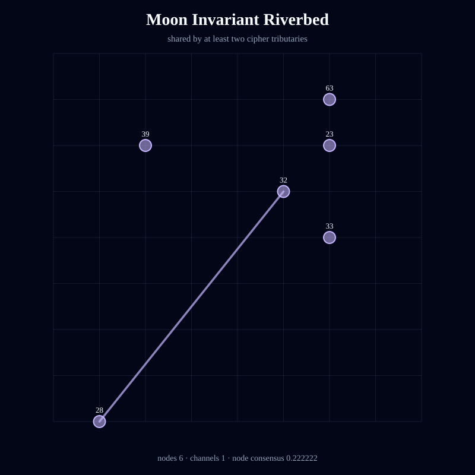
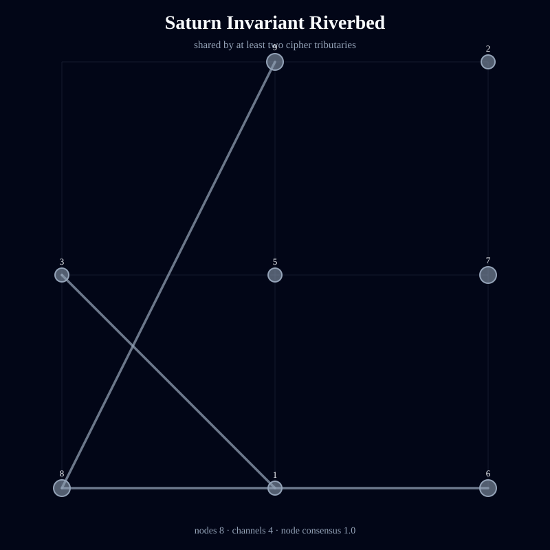
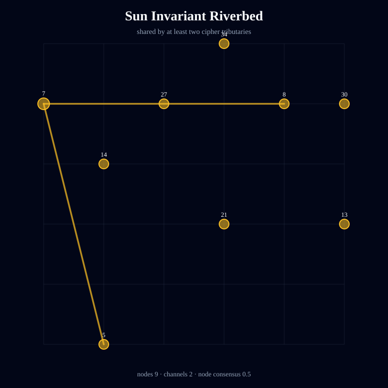
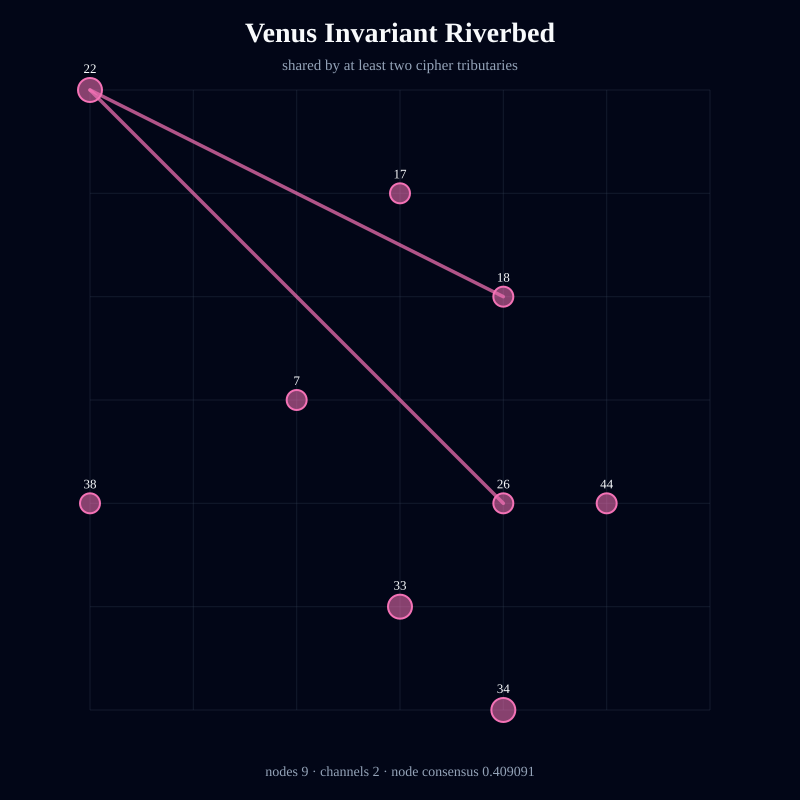

# Kamea Consciousness Flow — Thomas Edison

> Deterministic symbolic structure; not an empirical measurement of consciousness or causality.

- Full traversal steps: **245**
- Independent tributaries: **21**
- Directed channels: **219**
- Flow entropy: **0.964884**
- Recurrence: **0.473469**
- Directional coherence: **0.0497**
- Invariant riverbed nodes: **59**
- Invariant riverbed channels: **12**
- Mean geometric shape consensus: **0.275069**

## Unified Geometric Shape

## Planetary Riverbeds

### Jupiter

Streams: 3 · invariant nodes: 11 · invariant channels: 1 · node consensus: 0.6875 · edge consensus: 0.033333

### Mars

Streams: 3 · invariant nodes: 8 · invariant channels: 1 · node consensus: 0.666667 · edge consensus: 0.034483

### Mercury

Streams: 3 · invariant nodes: 8 · invariant channels: 1 · node consensus: 0.307692 · edge consensus: 0.032258

### Moon

Streams: 3 · invariant nodes: 6 · invariant channels: 1 · node consensus: 0.222222 · edge consensus: 0.032258

### Saturn

Streams: 3 · invariant nodes: 8 · invariant channels: 4 · node consensus: 1.0 · edge consensus: 0.153846

### Sun

Streams: 3 · invariant nodes: 9 · invariant channels: 2 · node consensus: 0.5 · edge consensus: 0.066667

### Venus

Streams: 3 · invariant nodes: 9 · invariant channels: 2 · node consensus: 0.409091 · edge consensus: 0.066667

